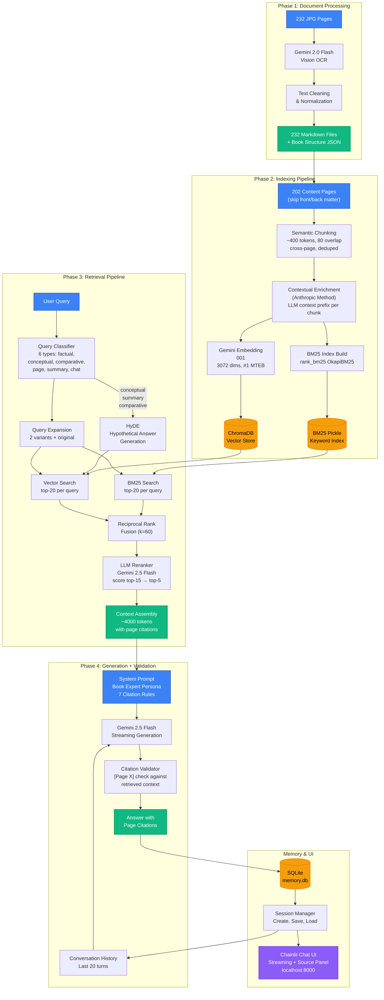

# Toughness Training RAG Chatbot

A conversational AI expert on **"The New Toughness Training for Sports"** by James E. Loehr. Ask it anything about mental toughness, the Ideal Performance State, recovery techniques, training cycles, or any concept from the book's 232 pages.

Built with a state-of-the-art RAG pipeline: contextual enrichment, hybrid search, LLM reranking, query classification, and citation validation.

## Architecture



## Features

| Feature | Description | Cost |
|---------|-------------|------|
| **Contextual Enrichment** | Anthropic method — LLM-generated context prefix per chunk before embedding | ~$0.35 one-time |
| **Hybrid Search** | Vector (ChromaDB) + keyword (BM25) with Reciprocal Rank Fusion | Free (local) |
| **LLM Reranker** | Gemini 2.5 Flash scores top-15 candidates, returns top-5 | ~$0.0002/query |
| **Query Classification** | Routes queries into 6 types for smarter retrieval | ~$0.0001/query |
| **HyDE** | Hypothetical Document Embedding for conceptual queries | ~$0.0003/query |
| **Citation Validation** | Flags hallucinated `[Page X]` references not in retrieved context | Free (regex) |
| **Streaming Chat** | Real-time token streaming via Chainlit UI | — |
| **Conversation Memory** | SQLite-backed session persistence with last 20 turns | Free (local) |

## Quick Start

### Prerequisites

- Python 3.12+
- [Gemini API key](https://aistudio.google.com/apikey)

### Setup

```bash
# Clone
git clone https://github.com/samOrbs/thinkingtough.git
cd thinkingtough

# Virtual environment
python -m venv .venv
source .venv/bin/activate  # Linux/Mac
# .venv\Scripts\activate   # Windows

# Install dependencies
pip install -r requirements.txt

# Configure API key
echo "GEMINI_API_KEY=your-key-here" > .env
```

### Run

```bash
# Step 1: OCR (only needed if you have the source JPGs in pages/)
python -m src.ocr

# Step 2: Build the index (chunks, enriches, embeds, stores)
python -m src.indexing

# Step 3: Launch the chatbot
chainlit run app.py
```

Open **http://localhost:8000** and start asking questions.

### Test Retrieval Standalone

```bash
python -m src.retrieval "What is the Ideal Performance State?"
```

## Cost Breakdown

| Component | Cost |
|-----------|------|
| OCR (232 pages, one-time) | ~$0.06 |
| Embeddings (one-time) | ~$0.001 |
| Contextual Enrichment (one-time) | ~$0.35 |
| **Total one-time build** | **~$0.41** |
| **Per query** | **~$0.002** |
| **Monthly (50 queries/day)** | **~$3** |

## Tech Stack

- **LLM:** Gemini 2.5 Flash (generation, reranking, classification, HyDE, enrichment)
- **Embeddings:** `gemini-embedding-001` (3072 dims, #1 on MTEB)
- **Vector DB:** ChromaDB (local, persistent)
- **Keyword Search:** BM25 via `rank_bm25`
- **Rank Fusion:** Reciprocal Rank Fusion (k=60)
- **UI:** Chainlit (streaming responses, source citation panel)
- **Memory:** SQLite
- **SDK:** `google-genai`

## Project Structure

```
toughness/
├── app.py                  # Chainlit chat UI entry point
├── src/
│   ├── ocr.py              # Phase 1: Gemini Vision OCR
│   ├── indexing.py          # Phase 2: Chunk, enrich, embed, store
│   ├── retrieval.py         # Phase 3: Classify, expand, search, rerank
│   ├── generation.py        # Phase 4: Generate + validate citations
│   └── memory.py            # Session persistence (SQLite)
├── data/
│   ├── pages_markdown/      # 232 OCR'd markdown pages
│   ├── chroma_db/           # ChromaDB vector store
│   ├── bm25_index.pkl       # BM25 keyword index
│   ├── book_structure.json  # Chapter/section metadata
│   └── memory.db            # Conversation history
├── obsidian-vault/          # Research docs + architecture diagrams
│   ├── System Architecture.canvas
│   ├── Implementation Plan.canvas
│   ├── Work Log.canvas
│   └── Feature Roadmap.canvas
├── requirements.txt
└── CLAUDE.md                # Build rules for Claude Code
```

## Adding a New Book from Internet Archive

This project includes a two-step scraper for capturing books from [Internet Archive](https://archive.org) as page images, ready for the OCR pipeline.

### Prerequisites

- A browser with DevTools (Chrome/Edge/Firefox)
- Python with Pillow (`pip install Pillow`)

### Step 1: Capture Pages (Browser Console)

1. Go to the book on Internet Archive (e.g. `archive.org/details/bookid`)
2. Click **Borrow** or **Read** to open the BookReader
3. Open DevTools (`F12` → **Console** tab)
4. Paste the contents of `internechive PDF builder/capture_pages.js` and press Enter
5. The script will:
   - Iterate through every page in the BookReader
   - Capture each rendered page image as a JPEG
   - Package all pages into a `.tar` file
   - Automatically download the tar when complete
6. Progress is logged in the console — expect ~1.5s per page

### Step 2: Extract Pages & Build PDF

```bash
# Basic usage — extracts JPGs to pages/ and builds a PDF
python "internechive PDF builder/build_pdf.py" ~/Downloads/mindfulathletese0000mumf_pages.tar

# With custom output name
python "internechive PDF builder/build_pdf.py" ~/Downloads/mindfulathletese0000mumf_pages.tar "The Mindful Athlete"
```

This produces:
- `pages/page_0001.jpg` through `page_NNNN.jpg` — individual page images
- `<name>.pdf` — combined PDF of all pages

### Step 3: Run the RAG Pipeline

```bash
# OCR all pages to markdown
python -m src.ocr

# Build the search index (chunk, enrich, embed, store)
python -m src.indexing

# Launch the chatbot
chainlit run app.py
```

> **Note:** Update the page skip ranges in `src/indexing.py` (`SKIP_PAGES`) for each book's front/back matter.

## Roadmap

- [ ] Discord bot (`/ask` slash command, thread-based conversations)
- [ ] Cloud deployment (Railway/Heroku with Docker)
- [ ] RAPTOR multi-level summaries
- [ ] Agentic tools (notes, flashcards, study plans)
- [ ] Evaluation suite (RAGAS + DeepEval, 50+ gold Q&A pairs)
- [ ] Model routing (simple → Flash, complex → Claude Sonnet)
- [ ] Prompt caching (90% savings on static tokens)
