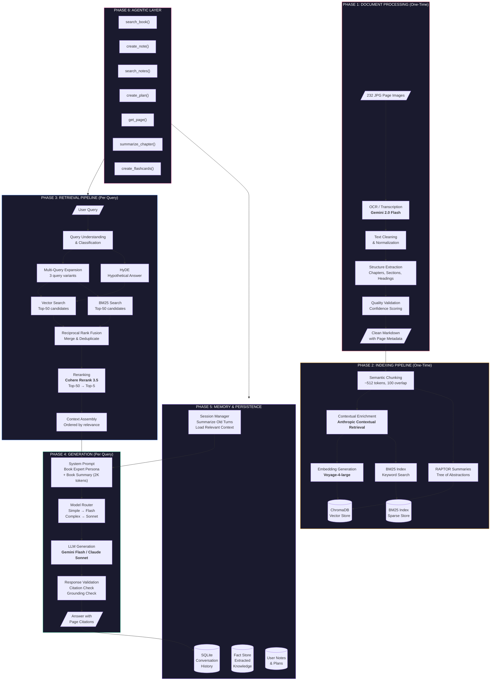
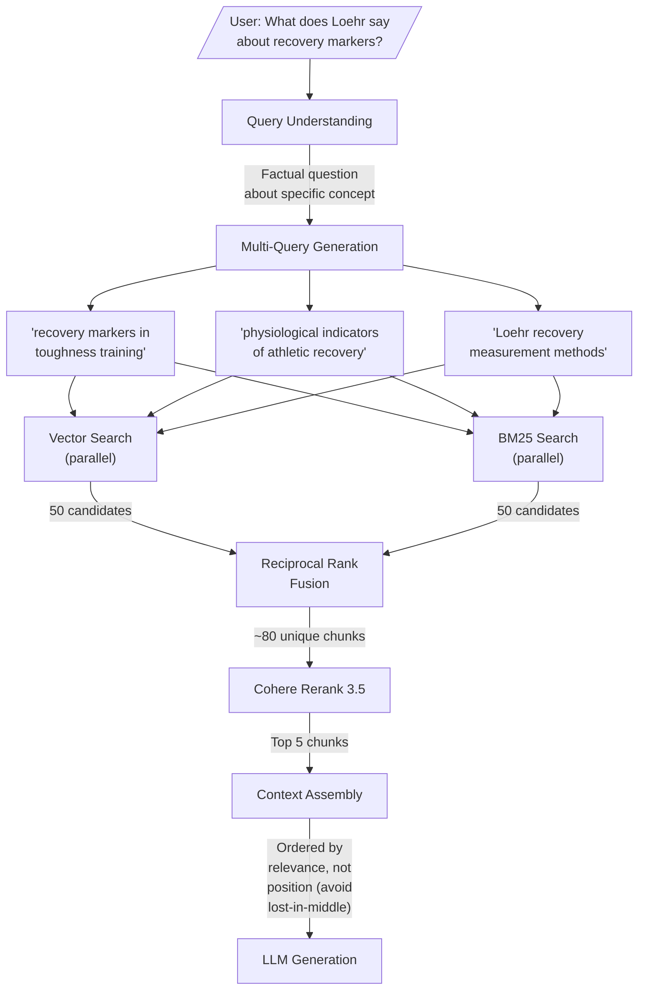
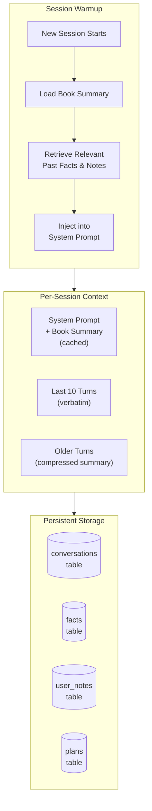

# Book Expert RAG — System Architecture

> A production-grade conversational RAG system that makes an LLM a deep expert on a scanned book, with persistent memory and agentic capabilities.

## Master Pipeline Diagram

## Detailed Subsystem Diagrams

### Document Processing Detail

```mermaid
flowchart LR
    subgraph OCR["OCR Pipeline"]
        direction TB
        IMG[/"page_0001.jpg<br/>through<br/>page_0232.jpg"/]
        IMG --> BATCH["Gemini Batch API<br/>50 pages per batch"]
        BATCH --> PROMPT["Transcription Prompt<br/>Preserve structure<br/>Output markdown"]
        PROMPT --> RAW[/"Raw Markdown<br/>per page"/]
    end

    subgraph CLEAN["Cleaning Pipeline"]
        direction TB
        RAW --> DEHYPH["Rejoin Hyphenated<br/>Line-Break Words"]
        DEHYPH --> HEADER["Remove Running<br/>Headers & Footers"]
        HEADER --> NORM["Unicode<br/>Normalization"]
        NORM --> STRUCT["Detect Headings<br/>Chapters, Sections"]
    end

    subgraph VALIDATE["Validation"]
        direction TB
        STRUCT --> SPELL["Spell Check<br/>Flag Anomalies"]
        SPELL --> CONF["Confidence Score<br/>Per Page"]
        CONF --> REVIEW["Human Review<br/>Low-Confidence Pages"]
        REVIEW --> FINAL[/"Final Markdown<br/>book.md"/]
    end
```

### Retrieval Detail

### Memory Architecture Detail

## Navigation

| Section | Link |
|---------|------|
| Document Processing | [[02-document-processing/Overview]] |
| Indexing Pipeline | [[03-indexing-pipeline/Overview]] |
| Retrieval Pipeline | [[04-retrieval-pipeline/Overview]] |
| Generation Layer | [[05-generation-layer/Overview]] |
| Memory & Persistence | [[06-memory-persistence/Overview]] |
| Agentic Layer | [[07-agentic-layer/Overview]] |
| Evaluation & Testing | [[08-evaluation-testing/Overview]] |
| Deployment | [[09-deployment/Overview]] |

## Recommended Stack

| Component | Choice | Rationale |
|-----------|--------|-----------|
| OCR | Gemini 2.0 Flash | Best accuracy/cost for printed text |
| Chunking | Semantic (paragraph-boundary) | Preserves natural text units |
| Enrichment | Anthropic Contextual Retrieval | 67% fewer retrieval failures |
| Embeddings | Voyage-4-large | SOTA MTEB scores |
| Vector DB | ChromaDB | Free, local, sufficient for 1 book |
| Keyword Search | rank_bm25 | Lightweight, no server needed |
| Reranking | Cohere Rerank 3.5 | Best quality/cost reranker |
| Daily LLM | Gemini 2.5 Flash | Cheapest capable model |
| Deep Analysis LLM | Claude Sonnet 4.5 | Best reasoning |
| Memory | SQLite + custom | Simple, portable, sufficient |
| Agent Framework | Claude tool use (no framework) | Minimal complexity |
| UI | Chainlit | Purpose-built chat UI for RAG |
| Evaluation | RAGAS + DeepEval | Industry standard metrics |

## Cost Summary

| Phase | One-Time | Monthly (~50 queries/day) |
|-------|----------|--------------------------|
| OCR Transcription | $0.07 | — |
| Contextual Enrichment | $1–3 | — |
| Embeddings | $0.03 | — |
| Vector DB | Free | Free |
| LLM Queries (Flash) | — | $5 |
| Reranking | — | $3 |
| Memory Storage | Free | Free |
| **Total** | **~$4** | **~$8/mo** |
