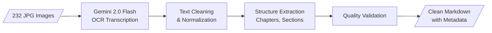

# Document Processing Pipeline

> **Back to**: [[01-system-overview/System Diagram]]

## Pipeline Overview



---

## 1. OCR / Transcription

### Model Choice: Gemini 2.0 Flash

| Factor | Gemini 2.0 Flash | Gemini 2.5 Pro |
|--------|-----------------|----------------|
| Cost (232 pages) | **$0.065** | $1.16 |
| Accuracy (printed text) | ~98%+ | ~99% |
| Speed | ~0.5s/page | ~2s/page |
| Use case | Primary model | Fallback for low-quality pages |

### Optimal Transcription Prompt

```
You are an expert OCR engine. Transcribe the text on this scanned book page
exactly as it appears, preserving:
- All paragraph breaks and line structure
- Headings, subheadings, and their hierarchy (use markdown ## syntax)
- Any italics, bold, or special formatting (indicate with markdown)
- Footnotes (use [^N] syntax)
- Page numbers

Rules:
- Rejoin hyphenated words split across line breaks
- Output clean markdown format
- Do NOT add any commentary, interpretation, or summary
- If text is unclear, indicate with [?]
- Preserve the original language exactly
- Ignore any bleed-through text from the reverse side of the page

Also output YAML front matter with:
- page_number: (the printed page number if visible)
- page_type: (text | blank | figure | toc | index | title)
- confidence: (high | medium | low)
- scan_quality: (good | fair | poor)
```

### Implementation with Gemini API

```python
import google.genai as genai
from pathlib import Path
from tenacity import retry, stop_after_attempt, wait_exponential

client = genai.Client()

@retry(stop=stop_after_attempt(3), wait=wait_exponential(min=2, max=30))
def transcribe_page(image_path: str, page_index: int) -> str:
    """Transcribe a single page image using Gemini 2.0 Flash."""
    image = genai.types.Part.from_uri(
        file_uri=upload_file(image_path),
        mime_type="image/jpeg"
    )

    response = client.models.generate_content(
        model="gemini-2.0-flash",
        contents=[TRANSCRIPTION_PROMPT, image],
        config=genai.types.GenerateContentConfig(
            temperature=0.0,
            max_output_tokens=4096,
        )
    )
    return response.text

def transcribe_book(pages_dir: str, output_dir: str):
    """Transcribe all pages with progress tracking and resume support."""
    pages = sorted(Path(pages_dir).glob("page_*.jpg"))
    state_file = Path(output_dir) / "state.json"

    # Resume from where we left off
    completed = load_state(state_file) if state_file.exists() else set()

    for page_path in pages:
        idx = int(page_path.stem.split("_")[1])
        if idx in completed:
            continue

        text = transcribe_page(str(page_path), idx)
        output_path = Path(output_dir) / f"page_{idx:04d}.md"
        output_path.write_text(text, encoding="utf-8")

        completed.add(idx)
        save_state(state_file, completed)
```

### Multi-Pass OCR Strategy

**Pass 1**: Transcribe all pages with Gemini 2.0 Flash
**Pass 2**: Run quality validation (see Section 4)
**Pass 3**: Re-transcribe low-scoring pages with Gemini 2.5 Pro

---

## 2. Text Cleaning & Normalization

### Hyphenated Line-Break Words

```python
import re

def rejoin_hyphenated_words(text: str) -> str:
    """Rejoin words split by hyphens at line breaks."""
    # Match: word fragment + hyphen + newline + word fragment (lowercase continuation)
    return re.sub(r'(\w+)-\n(\w+)', r'\1\2', text)
```

### Running Headers & Footers

```python
def remove_running_headers(text: str, book_title: str = "") -> str:
    """Remove repeated running headers/footers from page text."""
    lines = text.split('\n')
    cleaned = []
    for i, line in enumerate(lines):
        stripped = line.strip()
        # Skip lines that are just page numbers
        if re.match(r'^\d{1,3}$', stripped):
            continue
        # Skip lines matching running header pattern
        if i < 3 and book_title and stripped.upper() == book_title.upper():
            continue
        # Skip "CHAPTER N" headers at top of page
        if i < 3 and re.match(r'^CHAPTER\s+\d+', stripped, re.IGNORECASE):
            continue
        cleaned.append(line)
    return '\n'.join(cleaned)
```

### Unicode Normalization

```python
import ftfy
import unicodedata

def normalize_text(text: str) -> str:
    """Fix encoding issues and normalize Unicode."""
    text = ftfy.fix_text(text)  # Fix mojibake, encoding errors
    text = unicodedata.normalize('NFKC', text)  # Normalize Unicode forms

    # Normalize quotes and dashes
    text = text.replace('\u2018', "'").replace('\u2019', "'")  # Smart quotes
    text = text.replace('\u201c', '"').replace('\u201d', '"')
    text = text.replace('\u2014', '—')  # Em dash
    text = text.replace('\u2013', '–')  # En dash

    return text
```

---

## 3. Structure Extraction

### Chapter Detection

```python
def detect_chapters(pages: list[str]) -> list[dict]:
    """Detect chapter boundaries from page content."""
    chapters = []
    current_chapter = None

    chapter_patterns = [
        r'^#\s+Chapter\s+(\d+)[:\s]*(.*)',     # # Chapter 1: Title
        r'^##\s+(\d+)\.\s+(.*)',                 # ## 1. Title
        r'^CHAPTER\s+(\d+)\s*\n\s*(.*)',         # CHAPTER 1\nTitle
    ]

    for page_idx, page_text in enumerate(pages):
        for pattern in chapter_patterns:
            match = re.search(pattern, page_text, re.MULTILINE | re.IGNORECASE)
            if match:
                if current_chapter:
                    current_chapter['page_end'] = page_idx - 1
                    chapters.append(current_chapter)

                current_chapter = {
                    'number': int(match.group(1)),
                    'title': match.group(2).strip(),
                    'page_start': page_idx,
                }

    if current_chapter:
        current_chapter['page_end'] = len(pages) - 1
        chapters.append(current_chapter)

    return chapters
```

### Table of Contents Reconstruction

After structure extraction, generate a TOC note for the Obsidian vault linking to each chapter.

### Cross-Reference Linking

Convert references like "see Chapter 5" to Obsidian wikilinks `[[Chapter 05|Chapter 5]]` for graph view navigation.

---

## 4. Quality Validation

### Composite Scoring System (0-100)

| Factor | Weight | Description |
|--------|--------|-------------|
| Spelling accuracy | Up to -40 pts | Misspelled word ratio * 200, capped |
| Suspicious patterns | -5 per pattern | Repeated chars, mixed case, numbers in words |
| OCR self-confidence | -20 if low | From YAML front matter |
| Scan quality | -15 if poor | Model's assessment |
| Word count | -10 if < 50 | Abnormally few words |

**Score interpretation**:
- **90-100**: Excellent, no review needed
- **80-89**: Good, spot-check recommended
- **60-79**: Fair, human review recommended
- **Below 60**: Poor, re-OCR with Gemini 2.5 Pro

### Common OCR Errors in Printed Books

| Error | Example | Detection |
|-------|---------|-----------|
| `rn` → `m` | "burn" → "bum" | Dictionary lookup |
| `cl` → `d` | "clock" → "dock" | Dictionary lookup |
| `1`/`l`/`I` confusion | "III" → "111" | Context rules |
| `fi`/`fl` ligatures split | "final" → "f inal" | Whitespace detection |
| Joined words | "themost" | Dictionary + word splitting |

### Human Review Strategy

- **Tier 1**: Automated validation on all 232 pages
- **Tier 2**: Manual review of flagged pages (score < 80) + 5 random spot-checks
- **Tier 3**: Obsidian task list with embedded original scans for side-by-side comparison

---

## 5. Dependencies

```
pip install google-genai Pillow tenacity pyspellchecker rapidfuzz ftfy
```

## 6. Key References

- Gemini API Python SDK: https://ai.google.dev/gemini-api/docs/get-started/python
- Gemini Vision/Image understanding: https://ai.google.dev/gemini-api/docs/vision
- Gemini Batch API: https://ai.google.dev/gemini-api/docs/batch
- ftfy (text encoding fixer): https://pypi.org/project/ftfy/
- pyspellchecker: https://pypi.org/project/pyspellchecker/

---

#document-processing #ocr #gemini #text-cleaning #quality-validation
