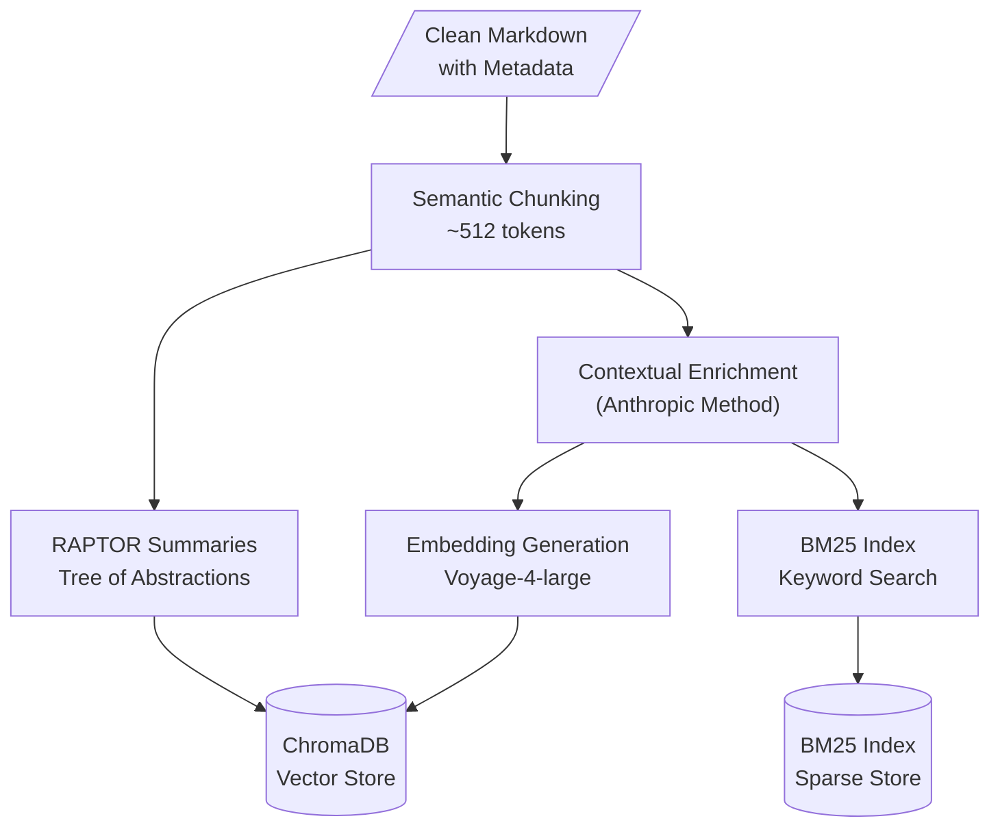

# Indexing Pipeline

> **Back to**: [[01-system-overview/System Diagram]]

## Pipeline Overview



---

## 1. Semantic Chunking

### Why Semantic Over Fixed-Size

| Strategy | Pros | Cons |
|----------|------|------|
| Fixed-size (512 tokens) | Simple, predictable | Splits mid-sentence, breaks context |
| Sentence-level | Clean boundaries | Too small for retrieval |
| **Paragraph-boundary** | Preserves natural units | Slight size variance |
| Recursive (LangChain) | Flexible | Complex, unpredictable splits |

**Chosen approach**: Paragraph-boundary chunking with a 512-token target and 100-token overlap.

### Implementation

```python
import re
from dataclasses import dataclass

@dataclass
class Chunk:
    text: str
    metadata: dict  # page_number, chapter, section, chunk_index

def semantic_chunk(
    text: str,
    max_tokens: int = 512,
    overlap_tokens: int = 100,
    metadata: dict = None
) -> list[Chunk]:
    """Split text at paragraph boundaries, respecting token limits."""
    paragraphs = re.split(r'\n\n+', text.strip())
    chunks = []
    current_paragraphs = []
    current_tokens = 0

    for para in paragraphs:
        para_tokens = len(para.split())  # Approximate token count

        if current_tokens + para_tokens > max_tokens and current_paragraphs:
            # Emit current chunk
            chunk_text = '\n\n'.join(current_paragraphs)
            chunks.append(Chunk(
                text=chunk_text,
                metadata={**(metadata or {}), 'chunk_index': len(chunks)}
            ))

            # Overlap: keep last paragraph(s) up to overlap_tokens
            overlap_paras = []
            overlap_count = 0
            for p in reversed(current_paragraphs):
                p_tokens = len(p.split())
                if overlap_count + p_tokens > overlap_tokens:
                    break
                overlap_paras.insert(0, p)
                overlap_count += p_tokens

            current_paragraphs = overlap_paras
            current_tokens = overlap_count

        current_paragraphs.append(para)
        current_tokens += para_tokens

    # Final chunk
    if current_paragraphs:
        chunks.append(Chunk(
            text='\n\n'.join(current_paragraphs),
            metadata={**(metadata or {}), 'chunk_index': len(chunks)}
        ))

    return chunks
```

### Metadata to Preserve Per Chunk

```python
chunk_metadata = {
    "page_number": 42,              # Original page
    "chapter_number": 3,            # Chapter index
    "chapter_title": "The Toughness Model",
    "section_heading": "Mental Recovery",
    "chunk_index": 7,               # Position within chapter
    "total_chunks_in_chapter": 15,
    "has_heading": True,             # Starts with a heading
    "source_file": "page_0042.md",
}
```

### Expected Output

For a 232-page book (~70,000 words):
- ~250-350 chunks at 512 tokens each
- Each chunk: 200-600 tokens (varies by paragraph boundaries)

---

## 2. Contextual Enrichment (Anthropic Method)

### The Problem

A raw chunk like:

> "Recovery periods should be 90-120 seconds between intervals. Heart rate must drop below 120 BPM before the next set."

...lacks context. A retrieval system searching for "Loehr's toughness training intervals" won't match well.

### The Solution: Contextual Retrieval

Prepend a short context sentence to each chunk **before** embedding. This is Anthropic's method that reduces retrieval failures by **67%**.

### Implementation

```python
import anthropic

client = anthropic.Anthropic()

CONTEXT_PROMPT = """<document>
{whole_document}
</document>

Here is the chunk we want to situate within the whole document:
<chunk>
{chunk_text}
</chunk>

Please give a short succinct context to situate this chunk within
the overall document for the purposes of improving search retrieval
of the chunk. Answer only with the succinct context and nothing else.
"""

def enrich_chunk(chunk_text: str, document_text: str) -> str:
    """Add contextual prefix to a chunk for better retrieval."""
    response = client.messages.create(
        model="claude-sonnet-4-5-20250929",
        max_tokens=200,
        messages=[{
            "role": "user",
            "content": CONTEXT_PROMPT.format(
                whole_document=document_text[:50000],  # First ~50K chars
                chunk_text=chunk_text
            )
        }]
    )
    context = response.content[0].text
    return f"{context}\n\n{chunk_text}"
```

### Prompt Caching for Cost Reduction

The entire book text is repeated for every chunk. Use Anthropic's prompt caching to avoid re-processing it:

```python
def enrich_chunks_with_caching(chunks: list[Chunk], document_text: str) -> list[Chunk]:
    """Enrich all chunks using prompt caching (90% cost reduction)."""
    enriched = []

    for chunk in chunks:
        response = client.messages.create(
            model="claude-sonnet-4-5-20250929",
            max_tokens=200,
            messages=[{
                "role": "user",
                "content": [
                    {
                        "type": "text",
                        "text": f"<document>\n{document_text}\n</document>",
                        "cache_control": {"type": "ephemeral"}  # Cache this part
                    },
                    {
                        "type": "text",
                        "text": f"""Here is the chunk we want to situate:
<chunk>
{chunk.text}
</chunk>

Please give a short succinct context to situate this chunk within
the overall document for the purposes of improving search retrieval
of the chunk. Answer only with the succinct context and nothing else."""
                    }
                ]
            }]
        )
        enriched_text = response.content[0].text + "\n\n" + chunk.text
        enriched.append(Chunk(text=enriched_text, metadata=chunk.metadata))

    return enriched
```

### Cost Estimate

| Item | Without Caching | With Caching |
|------|----------------|--------------|
| Document tokens (per chunk) | ~50K input | ~50K cached |
| Chunk + prompt tokens | ~600 input | ~600 input |
| Output tokens | ~50 | ~50 |
| Total for 300 chunks | **$2.70** | **$0.35** |

---

## 3. Embedding Generation

### Model Choice: Voyage-4-large

| Model | MTEB Score | Dimensions | Cost/1M tokens | Max Tokens |
|-------|-----------|------------|----------------|------------|
| **Voyage-4-large** | **67.8** | 1024 | $0.12 | 16,000 |
| text-embedding-3-large (OpenAI) | 64.6 | 3072 | $0.13 | 8,191 |
| Gemini text-embedding-004 | 66.0 | 768 | $0.006 | 2,048 |
| Cohere embed-v4.0 | 67.3 | 1024 | $0.10 | 4,096 |

Voyage-4-large leads MTEB benchmarks and integrates directly with ChromaDB.

### Implementation

```python
import voyageai

vo = voyageai.Client()

def embed_chunks(chunks: list[Chunk], batch_size: int = 128) -> list[list[float]]:
    """Generate embeddings for all chunks in batches."""
    all_embeddings = []

    for i in range(0, len(chunks), batch_size):
        batch_texts = [c.text for c in chunks[i:i + batch_size]]
        result = vo.embed(
            batch_texts,
            model="voyage-4-large",
            input_type="document"
        )
        all_embeddings.extend(result.embeddings)

    return all_embeddings

def embed_query(query: str) -> list[float]:
    """Embed a search query (uses input_type='query' for asymmetric search)."""
    result = vo.embed(
        [query],
        model="voyage-4-large",
        input_type="query"
    )
    return result.embeddings[0]
```

### Cost Estimate

- ~300 chunks * ~500 tokens = 150,000 tokens
- At $0.12 / 1M tokens = **$0.02** (negligible)

---

## 4. Vector Store: ChromaDB

### Why ChromaDB

| Feature | ChromaDB | Qdrant | Pinecone |
|---------|----------|--------|----------|
| Price | **Free** | Free (local) | $25/mo |
| Setup | `pip install` | Docker | Cloud API |
| Scale needed | 300 chunks | 300 chunks | 300 chunks |
| Persistence | Local SQLite | Local files | Cloud |

For a single book (~300 chunks), ChromaDB is ideal — zero cost, zero infrastructure.

### Implementation

```python
import chromadb

# Persistent storage
chroma_client = chromadb.PersistentClient(path="./chroma_db")

collection = chroma_client.get_or_create_collection(
    name="toughness_training",
    metadata={"hnsw:space": "cosine"}  # Cosine similarity
)

def index_chunks(chunks: list[Chunk], embeddings: list[list[float]]):
    """Store all chunks with embeddings and metadata in ChromaDB."""
    collection.add(
        ids=[f"chunk_{i}" for i in range(len(chunks))],
        embeddings=embeddings,
        documents=[c.text for c in chunks],
        metadatas=[c.metadata for c in chunks]
    )

def vector_search(query_embedding: list[float], n_results: int = 50) -> dict:
    """Search for similar chunks by vector similarity."""
    return collection.query(
        query_embeddings=[query_embedding],
        n_results=n_results,
        include=["documents", "metadatas", "distances"]
    )
```

---

## 5. BM25 Keyword Index

### Why Hybrid Search

Vector search excels at semantic similarity but misses exact keyword matches. BM25 catches:
- Proper nouns ("Loehr", "IPS")
- Acronyms and technical terms
- Exact phrases the user quotes
- Page number references

### Implementation

```python
from rank_bm25 import BM25Okapi
import pickle
import re

class BM25Index:
    def __init__(self):
        self.bm25 = None
        self.chunks = []

    def build(self, chunks: list[Chunk]):
        """Build BM25 index from chunks."""
        self.chunks = chunks
        tokenized = [self._tokenize(c.text) for c in chunks]
        self.bm25 = BM25Okapi(tokenized)

    def search(self, query: str, top_k: int = 50) -> list[tuple[Chunk, float]]:
        """Search by keyword relevance."""
        tokenized_query = self._tokenize(query)
        scores = self.bm25.get_scores(tokenized_query)

        # Get top-k indices
        top_indices = sorted(
            range(len(scores)),
            key=lambda i: scores[i],
            reverse=True
        )[:top_k]

        return [(self.chunks[i], scores[i]) for i in top_indices if scores[i] > 0]

    def _tokenize(self, text: str) -> list[str]:
        """Simple whitespace tokenization with lowercasing."""
        return re.findall(r'\w+', text.lower())

    def save(self, path: str):
        with open(path, 'wb') as f:
            pickle.dump({'bm25': self.bm25, 'chunks': self.chunks}, f)

    def load(self, path: str):
        with open(path, 'rb') as f:
            data = pickle.load(f)
            self.bm25 = data['bm25']
            self.chunks = data['chunks']
```

---

## 6. RAPTOR: Tree of Summaries

### What is RAPTOR?

RAPTOR (Recursive Abstractive Processing for Tree-Organized Retrieval) builds a hierarchy of summaries:

```
Level 0: Original chunks (300 chunks)
Level 1: Cluster summaries (~30 summaries of ~10 chunks each)
Level 2: Section summaries (~5 summaries of ~6 clusters each)
Level 3: Book summary (1 summary)
```

This enables answering questions at different abstraction levels:
- "What does page 42 say?" → Level 0 (original chunks)
- "What is Chapter 3 about?" → Level 1 (cluster summaries)
- "What are the main themes?" → Level 2-3 (high-level summaries)

### Implementation

```python
from sklearn.cluster import KMeans
import numpy as np

def build_raptor_tree(
    chunks: list[Chunk],
    embeddings: list[list[float]],
    levels: int = 3,
    cluster_size: int = 10
) -> list[Chunk]:
    """Build RAPTOR summary tree and return all summary chunks."""
    all_summaries = []
    current_texts = [c.text for c in chunks]
    current_embeddings = np.array(embeddings)

    for level in range(1, levels + 1):
        n_clusters = max(1, len(current_texts) // cluster_size)
        kmeans = KMeans(n_clusters=n_clusters, random_state=42)
        labels = kmeans.fit_predict(current_embeddings)

        level_summaries = []
        level_embeddings = []

        for cluster_id in range(n_clusters):
            cluster_texts = [
                current_texts[i] for i in range(len(labels))
                if labels[i] == cluster_id
            ]
            summary = generate_summary(cluster_texts, level)
            summary_embedding = embed_query(summary)

            level_summaries.append(summary)
            level_embeddings.append(summary_embedding)

            all_summaries.append(Chunk(
                text=summary,
                metadata={
                    'raptor_level': level,
                    'cluster_id': cluster_id,
                    'source_count': len(cluster_texts)
                }
            ))

        current_texts = level_summaries
        current_embeddings = np.array(level_embeddings)

    return all_summaries

def generate_summary(texts: list[str], level: int) -> str:
    """Generate a summary of a cluster of texts."""
    combined = "\n\n---\n\n".join(texts)

    response = client.messages.create(
        model="claude-sonnet-4-5-20250929",
        max_tokens=500,
        messages=[{
            "role": "user",
            "content": f"""Summarize the following passages from a book about
mental toughness training for sports. Create a comprehensive summary
that captures the key concepts, arguments, and specific details.

Level: {'cluster' if level == 1 else 'section' if level == 2 else 'book'} summary

Passages:
{combined}"""
        }]
    )
    return response.content[0].text
```

---

## 7. Full Indexing Pipeline

```python
def run_indexing_pipeline(markdown_dir: str, output_dir: str):
    """Run the complete indexing pipeline end-to-end."""
    # 1. Load cleaned markdown
    pages = load_pages(markdown_dir)
    full_text = "\n\n".join(pages)

    # 2. Chunk
    chunks = semantic_chunk(full_text, max_tokens=512, overlap_tokens=100)
    print(f"Created {len(chunks)} chunks")

    # 3. Contextual enrichment
    enriched = enrich_chunks_with_caching(chunks, full_text)
    print("Enriched all chunks with context")

    # 4. Embed
    embeddings = embed_chunks(enriched)
    print(f"Generated {len(embeddings)} embeddings")

    # 5. Store in ChromaDB
    index_chunks(enriched, embeddings)
    print("Stored in ChromaDB")

    # 6. Build BM25 index
    bm25 = BM25Index()
    bm25.build(enriched)
    bm25.save(f"{output_dir}/bm25_index.pkl")
    print("Built BM25 index")

    # 7. Build RAPTOR tree
    raptor_chunks = build_raptor_tree(chunks, embeddings)
    raptor_embeddings = embed_chunks(raptor_chunks)
    index_chunks(raptor_chunks, raptor_embeddings)  # Add to same ChromaDB
    print(f"Added {len(raptor_chunks)} RAPTOR summaries")
```

---

## 8. Dependencies

```
pip install chromadb voyageai rank-bm25 anthropic scikit-learn numpy
```

## 9. Cost Summary

| Component | Cost |
|-----------|------|
| Contextual Enrichment (with caching) | ~$0.35 |
| Voyage-4-large embeddings | ~$0.02 |
| RAPTOR summaries | ~$0.15 |
| ChromaDB storage | Free |
| BM25 index | Free |
| **Total (one-time)** | **~$0.52** |

---

#indexing #chunking #embeddings #contextual-retrieval #raptor #chromadb #bm25
