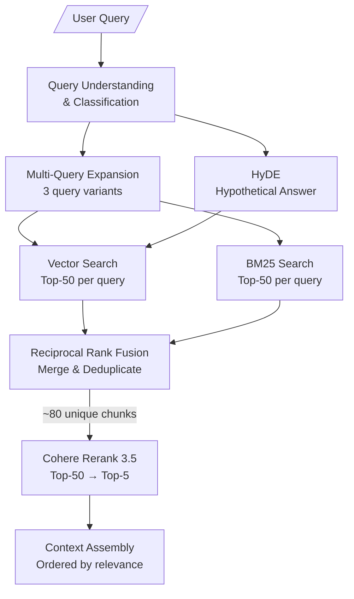

# Retrieval Pipeline

> **Back to**: [[01-system-overview/System Diagram]]

## Pipeline Overview



---

## 1. Query Understanding & Classification

### Query Types

| Type | Example | Strategy |
|------|---------|----------|
| **Factual** | "What is the IPS?" | Multi-query + BM25 (exact terms) |
| **Conceptual** | "How does mental recovery work?" | Multi-query + HyDE |
| **Comparative** | "Compare physical and mental toughness" | Multi-query (both aspects) |
| **Page-specific** | "What's on page 42?" | Direct metadata filter |
| **Summary** | "Summarize chapter 3" | RAPTOR (level 1-2 summaries) |
| **Conversational** | "Tell me more about that" | Resolve references from history, then search |

### Implementation

```python
def classify_query(query: str, conversation_history: list[dict]) -> dict:
    """Classify query type and determine retrieval strategy."""
    response = client.messages.create(
        model="gemini-2.0-flash",
        max_tokens=200,
        messages=[{
            "role": "user",
            "content": f"""Classify this query about a book on mental toughness training.

Query: {query}

Recent conversation:
{format_history(conversation_history[-3:])}

Return JSON:
{{
    "query_type": "factual|conceptual|comparative|page_specific|summary|conversational",
    "resolved_query": "<the query with pronouns/references resolved using conversation context>",
    "needs_hyde": true/false,
    "page_filter": null or page_number,
    "chapter_filter": null or chapter_number
}}"""
        }]
    )
    return parse_json(response.text)
```

---

## 2. Multi-Query Expansion

### Why Multi-Query?

A single query may miss relevant chunks due to vocabulary mismatch. Generating 3 variants covers more of the semantic space.

**Original**: "What does Loehr say about recovery?"
**Variant 1**: "recovery strategies in toughness training"
**Variant 2**: "rest and recuperation techniques for athletes"
**Variant 3**: "Loehr's approach to physical and mental recovery between training sessions"

### Implementation

```python
def expand_query(query: str, n_variants: int = 3) -> list[str]:
    """Generate query variants for broader retrieval coverage."""
    response = client.messages.create(
        model="gemini-2.0-flash",
        max_tokens=300,
        messages=[{
            "role": "user",
            "content": f"""Generate {n_variants} alternative search queries for
finding information in a book about mental toughness training for sports.

Original query: {query}

Requirements:
- Each variant should use different vocabulary/phrasing
- Cover different aspects of the question
- Include specific terms likely to appear in the book
- Return one query per line, no numbering"""
        }]
    )
    variants = [q.strip() for q in response.text.strip().split('\n') if q.strip()]
    return [query] + variants[:n_variants]  # Original + variants
```

---

## 3. HyDE (Hypothetical Document Embeddings)

### The Concept

Instead of embedding the question, generate a **hypothetical answer** and embed that. The hypothetical answer is closer in embedding space to the actual answer chunks than the question itself.

### When to Use

- Conceptual questions ("How does X work?")
- Questions where the book's vocabulary is unknown to the user
- NOT for factual lookups or page-specific queries

### Implementation

```python
def generate_hyde(query: str) -> str:
    """Generate a hypothetical answer for HyDE retrieval."""
    response = client.messages.create(
        model="gemini-2.0-flash",
        max_tokens=300,
        messages=[{
            "role": "user",
            "content": f"""You are an expert on mental toughness training for sports.
Write a short paragraph (3-5 sentences) answering this question as if
you were quoting from a textbook on the subject.

Question: {query}

Write in an authoritative, textbook style. Include specific concepts
and terminology that would appear in such a book."""
        }]
    )
    return response.text
```

---

## 4. Hybrid Search

### Vector Search

```python
def vector_search(queries: list[str], n_per_query: int = 50) -> list[dict]:
    """Run vector search for multiple query variants."""
    all_results = []

    for query in queries:
        embedding = embed_query(query)
        results = collection.query(
            query_embeddings=[embedding],
            n_results=n_per_query,
            include=["documents", "metadatas", "distances"]
        )
        for i, doc_id in enumerate(results['ids'][0]):
            all_results.append({
                'id': doc_id,
                'text': results['documents'][0][i],
                'metadata': results['metadatas'][0][i],
                'score': 1 - results['distances'][0][i],  # Convert distance to similarity
                'source': 'vector'
            })

    return all_results

```

### BM25 Search

```python
def bm25_search(queries: list[str], bm25_index: BM25Index, n_per_query: int = 50) -> list[dict]:
    """Run BM25 keyword search for multiple query variants."""
    all_results = []

    for query in queries:
        results = bm25_index.search(query, top_k=n_per_query)
        for chunk, score in results:
            all_results.append({
                'id': f"chunk_{chunk.metadata['chunk_index']}",
                'text': chunk.text,
                'metadata': chunk.metadata,
                'score': score,
                'source': 'bm25'
            })

    return all_results
```

---

## 5. Reciprocal Rank Fusion (RRF)

### Why RRF Over Simple Score Merging

Vector similarity scores (0-1) and BM25 scores (0-∞) are not comparable. RRF uses **rank positions** instead, which are always comparable.

### Formula

$$RRF(d) = \sum_{r \in R} \frac{1}{k + r(d)}$$

Where `k=60` (standard constant) and `r(d)` is the rank of document `d` in result set `r`.

### Implementation

```python
def reciprocal_rank_fusion(
    result_lists: list[list[dict]],
    k: int = 60
) -> list[dict]:
    """Merge multiple ranked result lists using RRF."""
    # Score each document by its rank across all lists
    rrf_scores = {}
    doc_data = {}

    for results in result_lists:
        # Deduplicate within each list, keeping best score
        seen = {}
        for r in results:
            if r['id'] not in seen or r['score'] > seen[r['id']]['score']:
                seen[r['id']] = r

        # Rank by score within this list
        ranked = sorted(seen.values(), key=lambda x: x['score'], reverse=True)

        for rank, result in enumerate(ranked):
            doc_id = result['id']
            rrf_scores[doc_id] = rrf_scores.get(doc_id, 0) + 1.0 / (k + rank + 1)
            doc_data[doc_id] = result  # Keep latest data

    # Sort by RRF score
    merged = sorted(rrf_scores.items(), key=lambda x: x[1], reverse=True)

    return [
        {**doc_data[doc_id], 'rrf_score': score}
        for doc_id, score in merged
    ]
```

---

## 6. Reranking with Cohere

### Why Reranking?

Bi-encoder (embedding) search is fast but approximate. A cross-encoder reranker sees query and document **together**, enabling much more accurate relevance scoring.

| Stage | Method | Speed | Accuracy |
|-------|--------|-------|----------|
| Initial retrieval | Bi-encoder (Voyage) | Fast (ms) | Good |
| **Reranking** | **Cross-encoder (Cohere)** | **Slower (100ms)** | **Excellent** |

### Model Choice: Cohere Rerank 3.5

| Model | Quality | Cost/1K searches | Latency |
|-------|---------|-------------------|---------|
| **Cohere Rerank 3.5** | **Best** | **$2.00** | ~200ms |
| Voyage Reranker | Good | $0.05 | ~150ms |
| BGE Reranker v2 (local) | Good | Free | ~500ms |

### Implementation

```python
import cohere

co = cohere.Client()

def rerank(
    query: str,
    candidates: list[dict],
    top_n: int = 5
) -> list[dict]:
    """Rerank candidates using Cohere Rerank 3.5."""
    if not candidates:
        return []

    response = co.rerank(
        model="rerank-v3.5",
        query=query,
        documents=[c['text'] for c in candidates],
        top_n=top_n,
        return_documents=False
    )

    reranked = []
    for result in response.results:
        candidate = candidates[result.index]
        candidate['rerank_score'] = result.relevance_score
        reranked.append(candidate)

    return reranked
```

---

## 7. Context Assembly

### Ordering Strategy: Relevance-First (Avoid "Lost in the Middle")

Research shows LLMs attend most to the beginning and end of context, losing information in the middle. We order chunks by **relevance score** (best first) rather than document position.

### Implementation

```python
def assemble_context(
    reranked_chunks: list[dict],
    max_tokens: int = 4000
) -> str:
    """Assemble retrieved chunks into a context string."""
    context_parts = []
    total_tokens = 0

    for i, chunk in enumerate(reranked_chunks):
        chunk_tokens = len(chunk['text'].split())

        if total_tokens + chunk_tokens > max_tokens:
            break

        page = chunk['metadata'].get('page_number', '?')
        chapter = chunk['metadata'].get('chapter_title', '')

        context_parts.append(
            f"[Source {i+1} | Page {page} | {chapter}]\n{chunk['text']}"
        )
        total_tokens += chunk_tokens

    return "\n\n---\n\n".join(context_parts)
```

---

## 8. Full Retrieval Pipeline

```python
def retrieve(
    query: str,
    conversation_history: list[dict],
    bm25_index: BM25Index,
    top_k: int = 5
) -> str:
    """Complete retrieval pipeline: query → context string."""

    # 1. Classify query
    classification = classify_query(query, conversation_history)
    resolved_query = classification['resolved_query']

    # 2. Expand query
    query_variants = expand_query(resolved_query, n_variants=3)

    # 3. Optional HyDE
    if classification['needs_hyde']:
        hyde_text = generate_hyde(resolved_query)
        query_variants.append(hyde_text)

    # 4. Parallel search
    vector_results = vector_search(query_variants, n_per_query=50)
    bm25_results = bm25_search(query_variants, bm25_index, n_per_query=50)

    # 5. Fuse results
    fused = reciprocal_rank_fusion([vector_results, bm25_results])

    # 6. Apply metadata filters
    if classification.get('page_filter'):
        fused = [r for r in fused if r['metadata'].get('page_number') == classification['page_filter']]
    if classification.get('chapter_filter'):
        fused = [r for r in fused if r['metadata'].get('chapter_number') == classification['chapter_filter']]

    # 7. Rerank top candidates
    candidates = fused[:50]  # Send top 50 to reranker
    reranked = rerank(resolved_query, candidates, top_n=top_k)

    # 8. Assemble context
    context = assemble_context(reranked)

    return context
```

---

## 9. Cost Per Query

| Component | Cost |
|-----------|------|
| Query classification (Gemini Flash) | ~$0.0001 |
| Multi-query expansion (Gemini Flash) | ~$0.0002 |
| HyDE generation (Gemini Flash) | ~$0.0002 |
| Query embedding (Voyage) | ~$0.00001 |
| Vector search (ChromaDB) | Free |
| BM25 search | Free |
| Cohere Rerank (50 docs) | ~$0.002 |
| **Total per query** | **~$0.003** |

At 50 queries/day = ~$0.15/day = **~$4.50/month** for retrieval alone.

---

#retrieval #hybrid-search #rrf #reranking #multi-query #hyde #cohere
