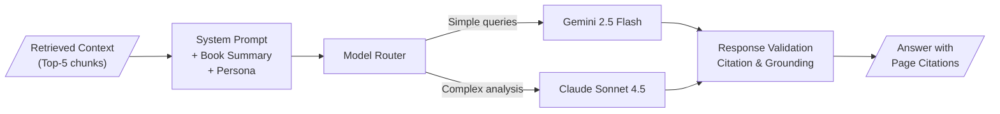

# Generation Layer

> **Back to**: [[01-system-overview/System Diagram]]

## Pipeline Overview



---

## 1. System Prompt Design

### Core Prompt Structure

```python
SYSTEM_PROMPT = """You are a deep expert on the book "The New Toughness Training
for Sports" by James E. Loehr. You have comprehensive knowledge of the entire
book and can discuss any concept, technique, or idea from it in detail.

## Book Summary
{book_summary}

## Your Capabilities
- Answer any question about the book's content with specific page references
- Explain concepts in depth, connecting ideas across chapters
- Compare and contrast different ideas within the book
- Create study notes, summaries, and flashcards
- Help the user build training plans based on the book's principles

## Rules
1. ALWAYS cite specific pages when referencing the book: [Page X]
2. If the retrieved context doesn't contain the answer, say so honestly —
   do not fabricate information about the book
3. Distinguish between what the book says and your own analysis
4. When the user asks about something NOT in the book, clearly state that
5. Use the conversation history to maintain context and avoid repeating yourself
6. Be conversational but precise — match the depth of your answer to the question

## Retrieved Context
{retrieved_context}

## Conversation History
{conversation_summary}
{recent_turns}
"""
```

### Book Summary (Cached, ~2K tokens)

Generate a comprehensive book summary during indexing and cache it permanently in the system prompt. This provides the LLM with a persistent "mental model" of the book's structure.

```python
def generate_book_summary(full_text: str) -> str:
    """Generate a comprehensive book summary for the system prompt."""
    response = client.messages.create(
        model="claude-sonnet-4-5-20250929",
        max_tokens=2000,
        messages=[{
            "role": "user",
            "content": f"""Read this entire book and create a comprehensive summary
(~1500 words) covering:

1. The book's thesis and central argument
2. Chapter-by-chapter overview with key concepts
3. Important terminology and definitions
4. Key frameworks, models, and techniques
5. Notable examples and case studies mentioned

Book text:
{full_text[:100000]}

Write in a neutral, encyclopedic style. This summary will be used
as permanent context for an AI assistant that answers questions about the book."""
        }]
    )
    return response.content[0].text
```

---

## 2. Prompt Caching

### Anthropic Prompt Caching

The system prompt + book summary (~2K tokens) is identical across all queries. With Anthropic's prompt caching:

| Component | Without Caching | With Caching |
|-----------|----------------|--------------|
| System prompt (2K tokens) | $0.006/query | $0.0006/query (10x cheaper) |
| Cache write | — | $0.0075 (once per 5 min) |
| Cache read | — | $0.0006/query |

### Implementation

```python
def generate_response(
    system_prompt: str,
    retrieved_context: str,
    conversation: list[dict],
    model: str = "claude-sonnet-4-5-20250929"
) -> str:
    """Generate a response with prompt caching."""
    messages = []

    # Add conversation history
    for turn in conversation[-10:]:
        messages.append({"role": turn["role"], "content": turn["content"]})

    response = client.messages.create(
        model=model,
        max_tokens=2000,
        system=[
            {
                "type": "text",
                "text": system_prompt,
                "cache_control": {"type": "ephemeral"}  # Cache system prompt
            },
            {
                "type": "text",
                "text": f"\n\n## Retrieved Context\n{retrieved_context}"
            }
        ],
        messages=messages
    )
    return response.content[0].text
```

### Gemini Prompt Caching

For Gemini Flash queries, use Gemini's context caching (different mechanism, same benefit):

```python
import google.genai as genai

# Create a cached context (persists for up to 1 hour)
cache = genai.caching.CachedContent.create(
    model="gemini-2.5-flash",
    contents=[{"role": "user", "parts": [{"text": system_prompt}]}],
    ttl="3600s"
)

# Use cached context for queries
def generate_with_cache(cache_name: str, query: str, context: str) -> str:
    response = genai.GenerativeModel.from_cached_content(cache_name).generate_content(
        f"Context:\n{context}\n\nQuestion: {query}"
    )
    return response.text
```

---

## 3. Model Router

### Routing Strategy

| Query Type | Complexity Signal | Model | Cost/query |
|-----------|-------------------|-------|------------|
| Factual lookup | Short question, specific topic | Gemini 2.5 Flash | ~$0.001 |
| Definition | "What is X?" | Gemini 2.5 Flash | ~$0.001 |
| Summary | "Summarize chapter X" | Gemini 2.5 Flash | ~$0.002 |
| Comparative | "Compare X and Y" | Claude Sonnet 4.5 | ~$0.015 |
| Deep analysis | "How does X relate to Y in context of Z" | Claude Sonnet 4.5 | ~$0.020 |
| Critical evaluation | "Is Loehr's argument about X valid?" | Claude Sonnet 4.5 | ~$0.020 |
| Multi-step reasoning | Complex chains, synthesis | Claude Sonnet 4.5 | ~$0.025 |

### Implementation

```python
def route_query(classification: dict) -> str:
    """Select the optimal model based on query complexity."""
    complex_types = {"comparative", "deep_analysis", "critical", "multi_step"}

    if classification['query_type'] in complex_types:
        return "claude-sonnet-4-5-20250929"

    # Use token count as complexity proxy
    if classification.get('estimated_output_tokens', 0) > 500:
        return "claude-sonnet-4-5-20250929"

    return "gemini-2.5-flash"
```

### Cost Impact

Assuming 70% simple / 30% complex split at 50 queries/day:

| Model | Queries/day | Cost/day | Monthly |
|-------|------------|----------|---------|
| Gemini 2.5 Flash | 35 | $0.035 | $1.05 |
| Claude Sonnet 4.5 | 15 | $0.30 | $9.00 |
| **Blended** | **50** | **$0.34** | **$10.05** |

Without routing (all Sonnet): $30/month. **Routing saves ~66%**.

---

## 4. Response Validation

### Citation Checking

Ensure every factual claim references a source from the retrieved context.

```python
def validate_citations(response: str, context_chunks: list[dict]) -> dict:
    """Check that citations in the response map to actual sources."""
    import re

    # Extract page references from response
    cited_pages = set(re.findall(r'\[Page\s+(\d+)\]', response))

    # Extract available pages from context
    available_pages = set()
    for chunk in context_chunks:
        if 'page_number' in chunk['metadata']:
            available_pages.add(str(chunk['metadata']['page_number']))

    # Check for hallucinated citations
    hallucinated = cited_pages - available_pages
    uncited_sources = available_pages - cited_pages

    return {
        'valid': len(hallucinated) == 0,
        'cited_pages': cited_pages,
        'hallucinated_pages': hallucinated,
        'uncited_sources': uncited_sources,
        'has_citations': len(cited_pages) > 0
    }
```

### Grounding Check

Verify the response doesn't contradict the retrieved context.

```python
def check_grounding(response: str, context: str) -> dict:
    """Use a fast model to check if response is grounded in context."""
    result = client.models.generate_content(
        model="gemini-2.0-flash",
        contents=f"""Compare this response against the source context.

Response:
{response}

Source Context:
{context}

Return JSON:
{{
    "grounded": true/false,
    "unsupported_claims": ["list of claims not supported by context"],
    "contradictions": ["list of claims that contradict context"]
}}"""
    )
    return parse_json(result.text)
```

---

## 5. Structured Output

### Answer Format

```python
@dataclass
class GeneratedAnswer:
    text: str                    # The answer text with inline citations
    cited_pages: list[int]       # Pages referenced
    confidence: str              # high / medium / low
    model_used: str              # Which model generated this
    retrieval_scores: list[float]  # Rerank scores of used chunks
    tokens_used: dict            # input_tokens, output_tokens, cached_tokens
    latency_ms: int              # End-to-end response time
```

### Streaming Support

For the chat UI, stream responses token-by-token:

```python
async def generate_streaming(system_prompt, context, messages, model):
    """Stream response tokens for real-time display."""
    with client.messages.stream(
        model=model,
        max_tokens=2000,
        system=system_prompt,
        messages=messages
    ) as stream:
        full_response = ""
        for text in stream.text_stream:
            full_response += text
            yield text  # Send to UI immediately

    return full_response
```

---

## 6. Handling Edge Cases

### No Relevant Context Found

```python
if not reranked_chunks or reranked_chunks[0]['rerank_score'] < 0.3:
    return GeneratedAnswer(
        text="I couldn't find relevant information about that in the book. "
             "Could you rephrase your question, or are you asking about "
             "something outside the book's scope?",
        confidence="low",
        cited_pages=[]
    )
```

### Question Outside Book Scope

The system prompt instructs the LLM to distinguish between book content and general knowledge. The grounding check catches responses that go beyond the retrieved context.

### Ambiguous References

When the user says "tell me more about that", the query classifier resolves references using conversation history before retrieval.

---

## 7. Dependencies

```
pip install anthropic google-genai
```

---

#generation #system-prompt #prompt-caching #model-routing #citation-checking #grounding
