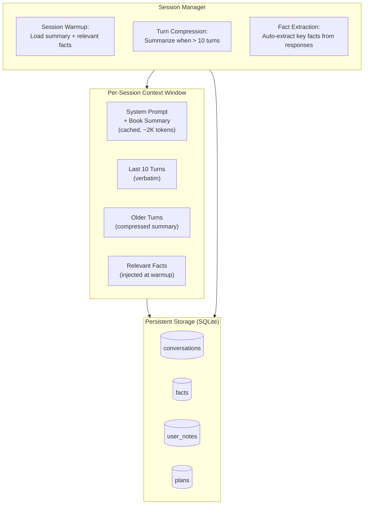

# Memory & Persistence

> **Back to**: [[01-system-overview/System Diagram]]

## Architecture Overview



---

## 1. Memory Tiers

### Tier 1: Core Memory (Always in Context)

| Component | Size | Lifetime |
|-----------|------|----------|
| System prompt | ~500 tokens | Permanent |
| Book summary | ~1,500 tokens | Permanent |
| User profile | ~200 tokens | Permanent |
| **Total** | **~2,200 tokens** | **Cached** |

This is the "identity" of the assistant — always present, cached via prompt caching for 90% cost reduction.

### Tier 2: Working Memory (Current Session)

| Component | Size | Lifetime |
|-----------|------|----------|
| Last 10 turns (verbatim) | ~4,000 tokens | Session |
| Compressed older turns | ~500 tokens | Session |
| Retrieved context | ~3,000 tokens | Per-query |
| **Total** | **~7,500 tokens** | **Session** |

### Tier 3: Long-Term Memory (Persistent)

| Component | Size | Lifetime |
|-----------|------|----------|
| Conversation history | Unlimited | Permanent |
| Extracted facts | Unlimited | Permanent |
| User notes | Unlimited | Permanent |
| Study plans | Unlimited | Permanent |

---

## 2. SQLite Schema

```sql
-- Core tables
CREATE TABLE conversations (
    id INTEGER PRIMARY KEY AUTOINCREMENT,
    session_id TEXT NOT NULL,
    role TEXT NOT NULL,          -- 'user' or 'assistant'
    content TEXT NOT NULL,
    model_used TEXT,
    tokens_used INTEGER,
    timestamp DATETIME DEFAULT CURRENT_TIMESTAMP
);

CREATE TABLE sessions (
    id TEXT PRIMARY KEY,
    title TEXT,                  -- Auto-generated from first query
    summary TEXT,                -- Compressed summary of the session
    started_at DATETIME DEFAULT CURRENT_TIMESTAMP,
    last_active DATETIME DEFAULT CURRENT_TIMESTAMP,
    turn_count INTEGER DEFAULT 0
);

CREATE TABLE facts (
    id INTEGER PRIMARY KEY AUTOINCREMENT,
    content TEXT NOT NULL,       -- The fact itself
    source_page INTEGER,         -- Page number reference
    chapter TEXT,                -- Chapter reference
    category TEXT,               -- concept, technique, definition, example, quote
    embedding BLOB,              -- Voyage embedding for retrieval
    extracted_from_session TEXT,  -- Which session extracted this
    timestamp DATETIME DEFAULT CURRENT_TIMESTAMP
);

CREATE TABLE user_notes (
    id INTEGER PRIMARY KEY AUTOINCREMENT,
    title TEXT NOT NULL,
    content TEXT NOT NULL,
    tags TEXT,                   -- JSON array of tags
    related_pages TEXT,          -- JSON array of page numbers
    created_at DATETIME DEFAULT CURRENT_TIMESTAMP,
    updated_at DATETIME DEFAULT CURRENT_TIMESTAMP
);

CREATE TABLE plans (
    id INTEGER PRIMARY KEY AUTOINCREMENT,
    title TEXT NOT NULL,
    description TEXT,
    steps TEXT NOT NULL,         -- JSON array of step objects
    status TEXT DEFAULT 'active', -- active, completed, archived
    created_at DATETIME DEFAULT CURRENT_TIMESTAMP,
    updated_at DATETIME DEFAULT CURRENT_TIMESTAMP
);

-- Indexes
CREATE INDEX idx_conversations_session ON conversations(session_id);
CREATE INDEX idx_facts_category ON facts(category);
CREATE INDEX idx_facts_chapter ON facts(chapter);
CREATE INDEX idx_notes_tags ON user_notes(tags);
```

---

## 3. Session Management

### Session Warmup

When a new session starts, load relevant context from persistent storage:

```python
import sqlite3
import json

class SessionManager:
    def __init__(self, db_path: str = "memory.db"):
        self.db = sqlite3.connect(db_path)
        self.session_id = None

    def start_session(self) -> str:
        """Initialize a new session with relevant context."""
        import uuid
        self.session_id = str(uuid.uuid4())

        self.db.execute(
            "INSERT INTO sessions (id) VALUES (?)",
            (self.session_id,)
        )
        self.db.commit()
        return self.session_id

    def get_warmup_context(self) -> str:
        """Load context for session start."""
        parts = []

        # Last session summary
        last_session = self.db.execute(
            "SELECT summary FROM sessions WHERE id != ? ORDER BY last_active DESC LIMIT 1",
            (self.session_id,)
        ).fetchone()
        if last_session and last_session[0]:
            parts.append(f"## Last Session Summary\n{last_session[0]}")

        # Most recent facts (last 20)
        facts = self.db.execute(
            "SELECT content, source_page, category FROM facts ORDER BY timestamp DESC LIMIT 20"
        ).fetchall()
        if facts:
            fact_lines = [f"- [{row[2]}] {row[0]} [Page {row[1]}]" for row in facts]
            parts.append(f"## Key Facts Discussed\n" + "\n".join(fact_lines))

        # Active plans
        plans = self.db.execute(
            "SELECT title, status FROM plans WHERE status = 'active'"
        ).fetchall()
        if plans:
            plan_lines = [f"- {row[0]}" for row in plans]
            parts.append(f"## Active Plans\n" + "\n".join(plan_lines))

        return "\n\n".join(parts)
```

### Turn Compression

When conversation exceeds 10 turns, compress older turns into a summary:

```python
def compress_history(self, turns: list[dict]) -> tuple[str, list[dict]]:
    """Compress older turns, keep recent 10 verbatim."""
    if len(turns) <= 10:
        return "", turns

    old_turns = turns[:-10]
    recent_turns = turns[-10:]

    # Summarize old turns
    old_text = "\n".join([
        f"{t['role']}: {t['content'][:200]}" for t in old_turns
    ])

    response = client.models.generate_content(
        model="gemini-2.0-flash",
        contents=f"""Summarize this conversation history concisely,
preserving key topics discussed, questions asked, and important
conclusions reached.

Conversation:
{old_text}

Write a concise summary (2-4 sentences)."""
    )

    return response.text, recent_turns
```

---

## 4. Automatic Fact Extraction

After every assistant response, extract any new facts for long-term storage:

```python
def extract_facts(self, response: str, context_chunks: list[dict]) -> list[dict]:
    """Extract key facts from an assistant response for long-term memory."""
    result = client.models.generate_content(
        model="gemini-2.0-flash",
        contents=f"""Extract key facts from this response about a book on
mental toughness training. Only extract specific, referenceable facts —
not general statements.

Response:
{response}

Return a JSON array of facts:
[
    {{
        "content": "The fact statement",
        "category": "concept|technique|definition|example|quote",
        "source_page": null or page_number
    }}
]

Return empty array [] if no specific facts worth remembering."""
    )

    facts = parse_json(result.text)
    for fact in facts:
        self.db.execute(
            "INSERT INTO facts (content, source_page, category, extracted_from_session) VALUES (?, ?, ?, ?)",
            (fact['content'], fact.get('source_page'), fact['category'], self.session_id)
        )
    self.db.commit()
    return facts
```

---

## 5. User Profile

Track user preferences and reading progress:

```python
USER_PROFILE_TEMPLATE = """## User Profile
- Reading progress: Chapter {current_chapter} of {total_chapters}
- Topics of interest: {interests}
- Preferred detail level: {detail_level}
- Session count: {session_count}
"""

def update_profile(self, key: str, value: str):
    """Update user profile setting."""
    self.db.execute(
        """INSERT INTO user_profile (key, value) VALUES (?, ?)
           ON CONFLICT(key) DO UPDATE SET value = ?""",
        (key, value, value)
    )
    self.db.commit()
```

---

## 6. Relevant Fact Retrieval

When a new query comes in, retrieve facts related to the current topic:

```python
def get_relevant_facts(self, query: str, limit: int = 10) -> list[dict]:
    """Retrieve facts relevant to the current query."""
    # Embed the query
    query_embedding = embed_query(query)

    # Search facts by embedding similarity
    all_facts = self.db.execute(
        "SELECT id, content, source_page, category, embedding FROM facts WHERE embedding IS NOT NULL"
    ).fetchall()

    if not all_facts:
        return []

    # Compute similarities
    scored = []
    for fact in all_facts:
        fact_embedding = deserialize_embedding(fact[4])
        similarity = cosine_similarity(query_embedding, fact_embedding)
        scored.append({
            'content': fact[1],
            'source_page': fact[2],
            'category': fact[3],
            'similarity': similarity
        })

    # Return top-k
    scored.sort(key=lambda x: x['similarity'], reverse=True)
    return scored[:limit]
```

---

## 7. Session End Summary

When a session ends, generate and store a summary:

```python
def end_session(self):
    """Summarize and archive the current session."""
    turns = self.db.execute(
        "SELECT role, content FROM conversations WHERE session_id = ? ORDER BY timestamp",
        (self.session_id,)
    ).fetchall()

    if len(turns) < 2:
        return

    conversation_text = "\n".join([f"{t[0]}: {t[1][:300]}" for t in turns])

    summary = client.models.generate_content(
        model="gemini-2.0-flash",
        contents=f"""Summarize this study session about a book on mental toughness
training. Include: topics covered, key questions asked, important conclusions,
and any notes or plans created.

Conversation:
{conversation_text}

Write a concise summary (3-5 sentences)."""
    ).text

    # Generate title from first user message
    title = turns[0][1][:80] if turns[0][0] == 'user' else "Study Session"

    self.db.execute(
        "UPDATE sessions SET summary = ?, title = ?, turn_count = ? WHERE id = ?",
        (summary, title, len(turns), self.session_id)
    )
    self.db.commit()
```

---

## 8. Context Window Budget

Total context window budget per query (~16K tokens for Gemini Flash, ~100K for Claude Sonnet):

| Component | Tokens | Notes |
|-----------|--------|-------|
| System prompt + book summary | 2,200 | Cached |
| Session warmup (facts, last session) | 500 | First query only |
| Conversation history (compressed + recent) | 4,500 | Grows over session |
| Retrieved context | 3,000 | Per-query |
| Retrieved relevant facts | 500 | Per-query |
| **Total input** | **~10,700** | Well within limits |
| Response output | ~500 | Average |

---

## 9. Dependencies

```
pip install sqlite3  # Built into Python
```

SQLite is chosen over PostgreSQL or Redis because:
- Zero infrastructure (single file)
- Sufficient for single-user, single-book use case
- Portable (copy one file to move everything)
- Fast enough for <1000 facts

---

#memory #persistence #sqlite #session-management #fact-extraction #context-window
