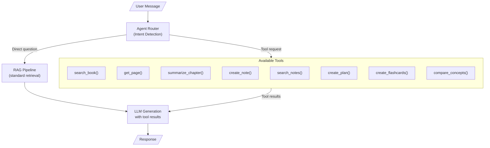

# Agentic Layer

> **Back to**: [[01-system-overview/System Diagram]]

## Architecture Overview



---

## 1. Tool Use Architecture

### Why Tool Use Over a Framework

| Approach | Pros | Cons |
|----------|------|------|
| LangChain Agent | Pre-built, many integrations | Heavy, abstractions leak, hard to debug |
| LlamaIndex Agent | Good for RAG-specific tasks | Opinionated, complex |
| **Claude/Gemini native tool use** | **Minimal code, full control, transparent** | **Manual orchestration** |

**Chosen approach**: Native tool use (Claude `tools` parameter / Gemini `function_calling`). No framework. The LLM decides which tools to call based on the user's message, and we execute them directly.

### How Tool Use Works

1. User sends a message
2. LLM receives message + tool schemas
3. LLM decides to either respond directly OR call one or more tools
4. If tools are called, we execute them and send results back to the LLM
5. LLM generates final response using tool results

---

## 2. Tool Schemas

### search_book

```python
SEARCH_BOOK_TOOL = {
    "name": "search_book",
    "description": "Search the book for information about a specific topic. "
                   "Use this when the user asks about something in the book and "
                   "you need to find relevant passages.",
    "input_schema": {
        "type": "object",
        "properties": {
            "query": {
                "type": "string",
                "description": "The search query — what to look for in the book"
            },
            "chapter_filter": {
                "type": "integer",
                "description": "Optional: limit search to a specific chapter number"
            }
        },
        "required": ["query"]
    }
}

def execute_search_book(query: str, chapter_filter: int = None) -> str:
    """Execute book search and return formatted results."""
    results = retrieve(query, [], bm25_index, top_k=5)
    if chapter_filter:
        results = [r for r in results if r['metadata'].get('chapter_number') == chapter_filter]
    return format_search_results(results)
```

### get_page

```python
GET_PAGE_TOOL = {
    "name": "get_page",
    "description": "Retrieve the full text of a specific page from the book.",
    "input_schema": {
        "type": "object",
        "properties": {
            "page_number": {
                "type": "integer",
                "description": "The page number to retrieve (1-232)"
            }
        },
        "required": ["page_number"]
    }
}

def execute_get_page(page_number: int) -> str:
    """Return full text of a specific page."""
    page_path = f"pages_markdown/page_{page_number:04d}.md"
    if not os.path.exists(page_path):
        return f"Page {page_number} not found."
    with open(page_path) as f:
        return f.read()
```

### summarize_chapter

```python
SUMMARIZE_CHAPTER_TOOL = {
    "name": "summarize_chapter",
    "description": "Generate a comprehensive summary of a specific chapter.",
    "input_schema": {
        "type": "object",
        "properties": {
            "chapter_number": {
                "type": "integer",
                "description": "The chapter number to summarize"
            },
            "detail_level": {
                "type": "string",
                "enum": ["brief", "detailed", "exhaustive"],
                "description": "How detailed the summary should be"
            }
        },
        "required": ["chapter_number"]
    }
}

def execute_summarize_chapter(chapter_number: int, detail_level: str = "detailed") -> str:
    """Search for RAPTOR summaries or generate a chapter summary on-the-fly."""
    # Try RAPTOR cache first
    raptor_results = collection.query(
        query_texts=[f"Chapter {chapter_number} summary"],
        where={"raptor_level": {"$gte": 1}, "chapter_number": chapter_number},
        n_results=3
    )
    if raptor_results['documents'][0]:
        return "\n\n".join(raptor_results['documents'][0])

    # Fall back to on-the-fly generation
    chapter_chunks = get_chapter_chunks(chapter_number)
    return generate_summary_from_chunks(chapter_chunks, detail_level)
```

### create_note

```python
CREATE_NOTE_TOOL = {
    "name": "create_note",
    "description": "Create a personal study note. Use this when the user "
                   "wants to save something for later review.",
    "input_schema": {
        "type": "object",
        "properties": {
            "title": {
                "type": "string",
                "description": "A short title for the note"
            },
            "content": {
                "type": "string",
                "description": "The note content in markdown format"
            },
            "tags": {
                "type": "array",
                "items": {"type": "string"},
                "description": "Tags for organizing the note"
            },
            "related_pages": {
                "type": "array",
                "items": {"type": "integer"},
                "description": "Page numbers this note relates to"
            }
        },
        "required": ["title", "content"]
    }
}

def execute_create_note(title, content, tags=None, related_pages=None) -> str:
    """Save a note to persistent storage."""
    session_mgr.db.execute(
        "INSERT INTO user_notes (title, content, tags, related_pages) VALUES (?, ?, ?, ?)",
        (title, content, json.dumps(tags or []), json.dumps(related_pages or []))
    )
    session_mgr.db.commit()
    return f"Note '{title}' saved successfully."
```

### search_notes

```python
SEARCH_NOTES_TOOL = {
    "name": "search_notes",
    "description": "Search through previously created study notes.",
    "input_schema": {
        "type": "object",
        "properties": {
            "query": {
                "type": "string",
                "description": "Search query for finding notes"
            },
            "tag": {
                "type": "string",
                "description": "Optional: filter by tag"
            }
        },
        "required": ["query"]
    }
}

def execute_search_notes(query: str, tag: str = None) -> str:
    """Search user notes by content and optional tag filter."""
    if tag:
        notes = session_mgr.db.execute(
            "SELECT title, content, tags FROM user_notes WHERE tags LIKE ? ORDER BY updated_at DESC",
            (f'%"{tag}"%',)
        ).fetchall()
    else:
        notes = session_mgr.db.execute(
            "SELECT title, content, tags FROM user_notes WHERE content LIKE ? OR title LIKE ? ORDER BY updated_at DESC",
            (f'%{query}%', f'%{query}%')
        ).fetchall()

    if not notes:
        return "No matching notes found."

    return "\n\n".join([
        f"### {n[0]}\n{n[1]}\nTags: {n[2]}" for n in notes
    ])
```

### create_plan

```python
CREATE_PLAN_TOOL = {
    "name": "create_plan",
    "description": "Create a study or training plan based on book concepts. "
                   "Use this when the user wants a structured plan.",
    "input_schema": {
        "type": "object",
        "properties": {
            "title": {
                "type": "string",
                "description": "Plan title"
            },
            "description": {
                "type": "string",
                "description": "What this plan is for"
            },
            "steps": {
                "type": "array",
                "items": {
                    "type": "object",
                    "properties": {
                        "step": {"type": "string"},
                        "details": {"type": "string"},
                        "duration": {"type": "string"}
                    }
                },
                "description": "Ordered list of plan steps"
            }
        },
        "required": ["title", "steps"]
    }
}
```

### create_flashcards

```python
CREATE_FLASHCARDS_TOOL = {
    "name": "create_flashcards",
    "description": "Generate study flashcards from a section of the book.",
    "input_schema": {
        "type": "object",
        "properties": {
            "topic": {
                "type": "string",
                "description": "The topic to create flashcards about"
            },
            "count": {
                "type": "integer",
                "description": "Number of flashcards to generate (default: 10)"
            },
            "chapter": {
                "type": "integer",
                "description": "Optional: limit to a specific chapter"
            }
        },
        "required": ["topic"]
    }
}

def execute_create_flashcards(topic: str, count: int = 10, chapter: int = None) -> str:
    """Generate flashcards by searching the book and creating Q&A pairs."""
    # Search for relevant content
    context = retrieve(topic, [], bm25_index, top_k=5)

    response = client.messages.create(
        model="claude-sonnet-4-5-20250929",
        max_tokens=2000,
        messages=[{
            "role": "user",
            "content": f"""Create {count} study flashcards about "{topic}" from this book content.

Context:
{context}

Format each flashcard as:
**Q:** [question]
**A:** [concise answer with page reference]

Focus on key concepts, definitions, and practical techniques."""
        }]
    )

    # Save as a note
    execute_create_note(
        title=f"Flashcards: {topic}",
        content=response.content[0].text,
        tags=["flashcards", topic.lower().replace(" ", "-")]
    )

    return response.content[0].text
```

### compare_concepts

```python
COMPARE_CONCEPTS_TOOL = {
    "name": "compare_concepts",
    "description": "Compare two concepts from the book side by side.",
    "input_schema": {
        "type": "object",
        "properties": {
            "concept_a": {
                "type": "string",
                "description": "First concept to compare"
            },
            "concept_b": {
                "type": "string",
                "description": "Second concept to compare"
            }
        },
        "required": ["concept_a", "concept_b"]
    }
}
```

---

## 3. Tool Execution Loop

### ReAct Pattern (Reason + Act)

```python
ALL_TOOLS = [
    SEARCH_BOOK_TOOL, GET_PAGE_TOOL, SUMMARIZE_CHAPTER_TOOL,
    CREATE_NOTE_TOOL, SEARCH_NOTES_TOOL, CREATE_PLAN_TOOL,
    CREATE_FLASHCARDS_TOOL, COMPARE_CONCEPTS_TOOL
]

TOOL_EXECUTORS = {
    "search_book": execute_search_book,
    "get_page": execute_get_page,
    "summarize_chapter": execute_summarize_chapter,
    "create_note": execute_create_note,
    "search_notes": execute_search_notes,
    "create_plan": execute_create_plan,
    "create_flashcards": execute_create_flashcards,
    "compare_concepts": execute_compare_concepts,
}

async def agent_loop(user_message: str, conversation: list[dict]) -> str:
    """Main agent loop with tool use."""
    messages = conversation + [{"role": "user", "content": user_message}]

    max_iterations = 5  # Prevent infinite loops
    for _ in range(max_iterations):
        response = client.messages.create(
            model="claude-sonnet-4-5-20250929",
            max_tokens=4096,
            system=SYSTEM_PROMPT,
            tools=ALL_TOOLS,
            messages=messages
        )

        # Check if the model wants to use tools
        if response.stop_reason == "tool_use":
            # Execute each tool call
            tool_results = []
            for block in response.content:
                if block.type == "tool_use":
                    executor = TOOL_EXECUTORS.get(block.name)
                    if executor:
                        result = executor(**block.input)
                    else:
                        result = f"Unknown tool: {block.name}"

                    tool_results.append({
                        "type": "tool_result",
                        "tool_use_id": block.id,
                        "content": result
                    })

            # Add assistant response and tool results to messages
            messages.append({"role": "assistant", "content": response.content})
            messages.append({"role": "user", "content": tool_results})

        else:
            # Model is done — return text response
            return extract_text(response.content)

    return "I've reached my tool use limit for this query. Please try again."
```

---

## 4. Guardrails

### Tool Call Limits

```python
MAX_TOOL_CALLS_PER_QUERY = 5     # Prevent runaway loops
MAX_SEARCH_RESULTS = 50           # Cap retrieval volume
MAX_NOTE_LENGTH = 10000           # Prevent oversized notes
MAX_FLASHCARDS = 30               # Reasonable flashcard limit
```

### Input Validation

```python
def validate_tool_input(tool_name: str, inputs: dict) -> tuple[bool, str]:
    """Validate tool inputs before execution."""
    if tool_name == "get_page":
        page = inputs.get("page_number", 0)
        if not (1 <= page <= 232):
            return False, f"Page number must be between 1 and 232, got {page}"

    if tool_name == "create_note":
        if len(inputs.get("content", "")) > MAX_NOTE_LENGTH:
            return False, f"Note content exceeds {MAX_NOTE_LENGTH} character limit"

    if tool_name == "create_flashcards":
        count = inputs.get("count", 10)
        if count > MAX_FLASHCARDS:
            return False, f"Maximum {MAX_FLASHCARDS} flashcards per request"

    return True, ""
```

### Cost Controls

```python
# Track token usage per session
class CostTracker:
    def __init__(self, daily_budget: float = 1.0):
        self.daily_budget = daily_budget
        self.daily_spend = 0.0

    def check_budget(self, estimated_cost: float) -> bool:
        return self.daily_spend + estimated_cost <= self.daily_budget

    def record_spend(self, actual_cost: float):
        self.daily_spend += actual_cost
```

---

## 5. Example Interactions

### Simple Question (No Tools)

```
User: "What is mental toughness according to Loehr?"
→ Agent: Uses standard RAG retrieval (no explicit tool call needed)
→ Response: "According to Loehr, mental toughness is... [Page 15]"
```

### Multi-Tool Interaction

```
User: "Create flashcards for Chapter 3 and save them with my notes"
→ Agent calls: search_book(query="Chapter 3 key concepts", chapter_filter=3)
→ Agent calls: create_flashcards(topic="Chapter 3 concepts", count=10, chapter=3)
→ Agent calls: create_note(title="Ch3 Flashcards", content=..., tags=["chapter-3"])
→ Response: "I've created 10 flashcards for Chapter 3 and saved them to your notes..."
```

### Comparison Request

```
User: "How does physical toughness differ from emotional toughness in the book?"
→ Agent calls: search_book(query="physical toughness definition and characteristics")
→ Agent calls: search_book(query="emotional toughness definition and characteristics")
→ Agent calls: compare_concepts(concept_a="physical toughness", concept_b="emotional toughness")
→ Response: Structured comparison with page citations
```

---

## 6. Dependencies

```
pip install anthropic  # Claude tool use is built into the API
```

No agent framework needed. The tool use capability is native to Claude and Gemini APIs.

---

#agentic #tool-use #react #guardrails #notes #flashcards #plans
