# Evaluation & Testing

> **Back to**: [[01-system-overview/System Diagram]]

## Evaluation Strategy

```mermaid
flowchart TB
    subgraph OFFLINE["Offline Evaluation (Before Deployment)"]
        direction TB
        DS["Test Dataset\n50+ Q&A pairs"] --> RAGAS["RAGAS Metrics"]
        DS --> DEEP["DeepEval Metrics"]
        RAGAS --> REPORT["Evaluation Report"]
        DEEP --> REPORT
    end

    subgraph ONLINE["Online Evaluation (In Production)"]
        direction TB
        USER["User Feedback\n👍/👎 per response"] --> DASH["Monitoring Dashboard"]
        LATENCY["Latency Tracking"] --> DASH
        COST["Cost Tracking"] --> DASH
        FAILS["Retrieval Failures"] --> DASH
    end

    subgraph ITERATE["Continuous Improvement"]
        direction TB
        REPORT --> FIX["Fix Identified Issues"]
        DASH --> FIX
        FIX --> REINDEX["Re-index / Re-tune"]
        REINDEX --> DS
    end
```



---

## 1. Test Dataset Creation

### Gold Standard Q&A Pairs

Create 50+ question-answer pairs manually by reading the book. This is the most important step — without good test data, evaluation is meaningless.

### Question Categories

| Category | Count | Example |
|----------|-------|---------|
| Factual (specific page) | 15 | "What are the 4 markers of toughness? [Page 28]" |
| Conceptual | 10 | "How does Loehr define emotional flexibility?" |
| Cross-chapter | 8 | "How do Chapter 3's techniques relate to Chapter 7's examples?" |
| Page-specific | 5 | "What diagram appears on page 95?" |
| Summary | 5 | "What is the main argument of Chapter 5?" |
| Negative (not in book) | 4 | "What does Loehr say about social media?" |
| Conversational follow-up | 3 | "[After discussing Ch3] Tell me more about that technique" |

### Format

```python
test_dataset = [
    {
        "question": "What are the four emotional markers of toughness according to Loehr?",
        "ground_truth": "The four emotional markers are: (1) emotional flexibility, "
                        "(2) emotional responsiveness, (3) emotional strength, and "
                        "(4) emotional resiliency. [Page 28-29]",
        "expected_pages": [28, 29],
        "category": "factual",
        "difficulty": "easy"
    },
    {
        "question": "How does the IPS training cycle work?",
        "ground_truth": "The Ideal Performance State (IPS) training cycle involves...",
        "expected_pages": [45, 46, 47],
        "category": "conceptual",
        "difficulty": "medium"
    },
    # ... 50+ more
]
```

---

## 2. RAGAS Metrics

RAGAS (Retrieval Augmented Generation Assessment) is the industry standard for RAG evaluation.

### Core Metrics

| Metric | What It Measures | Target |
|--------|-----------------|--------|
| **Faithfulness** | Does the answer only contain info from the context? | > 0.9 |
| **Answer Relevancy** | Is the answer relevant to the question? | > 0.85 |
| **Context Precision** | Are the retrieved chunks actually relevant? | > 0.8 |
| **Context Recall** | Did we retrieve all needed information? | > 0.8 |

### Implementation

```python
from ragas import evaluate
from ragas.metrics import (
    faithfulness,
    answer_relevancy,
    context_precision,
    context_recall,
)
from datasets import Dataset

def run_ragas_evaluation(test_data: list[dict], pipeline) -> dict:
    """Run RAGAS evaluation on the full pipeline."""
    results = []

    for item in test_data:
        # Run the full pipeline
        response, contexts = pipeline.query_with_contexts(item['question'])

        results.append({
            'question': item['question'],
            'answer': response,
            'contexts': [c['text'] for c in contexts],
            'ground_truth': item['ground_truth']
        })

    # Convert to HuggingFace Dataset
    dataset = Dataset.from_list(results)

    # Evaluate
    scores = evaluate(
        dataset,
        metrics=[
            faithfulness,
            answer_relevancy,
            context_precision,
            context_recall,
        ]
    )

    return scores
```

### Interpreting Results

```
Faithfulness:       0.92  ✅  (answers stay grounded in context)
Answer Relevancy:   0.88  ✅  (answers address the question)
Context Precision:  0.75  ⚠️  (some irrelevant chunks retrieved)
Context Recall:     0.82  ✅  (most relevant info is retrieved)
```

**If Context Precision is low**: Improve chunking or reranking
**If Context Recall is low**: Improve retrieval (more query variants, better embeddings)
**If Faithfulness is low**: Strengthen system prompt, add grounding checks
**If Answer Relevancy is low**: Improve query understanding

---

## 3. DeepEval Metrics

DeepEval provides additional metrics beyond RAGAS, particularly useful for conversational RAG:

### Additional Metrics

| Metric | What It Measures | Target |
|--------|-----------------|--------|
| **Hallucination** | Does the answer fabricate information? | < 0.1 |
| **Toxicity** | Is the answer inappropriate? | < 0.05 |
| **Bias** | Does the answer show bias? | < 0.1 |
| **Answer Correctness** | Is the answer factually correct vs ground truth? | > 0.8 |
| **Contextual Relevancy** | Is the context relevant to the question? | > 0.8 |

### Implementation

```python
from deepeval import evaluate as deep_evaluate
from deepeval.metrics import (
    HallucinationMetric,
    AnswerRelevancyMetric,
    FaithfulnessMetric,
    ContextualRelevancyMetric
)
from deepeval.test_case import LLMTestCase

def run_deepeval(test_data: list[dict], pipeline) -> dict:
    """Run DeepEval metrics on the pipeline."""
    test_cases = []

    for item in test_data:
        response, contexts = pipeline.query_with_contexts(item['question'])

        test_cases.append(LLMTestCase(
            input=item['question'],
            actual_output=response,
            expected_output=item['ground_truth'],
            retrieval_context=[c['text'] for c in contexts]
        ))

    metrics = [
        HallucinationMetric(threshold=0.1),
        AnswerRelevancyMetric(threshold=0.85),
        FaithfulnessMetric(threshold=0.9),
        ContextualRelevancyMetric(threshold=0.8),
    ]

    results = deep_evaluate(test_cases, metrics)
    return results
```

---

## 4. Component-Level Testing

### Retrieval Quality Test

```python
def test_retrieval_quality(test_data: list[dict]):
    """Test that retrieval finds the right pages."""
    hits = 0
    total = 0

    for item in test_data:
        if 'expected_pages' not in item:
            continue

        results = retrieve(item['question'], [], bm25_index, top_k=5)
        retrieved_pages = set()
        for r in results:
            if 'page_number' in r['metadata']:
                retrieved_pages.add(r['metadata']['page_number'])

        expected = set(item['expected_pages'])
        if expected & retrieved_pages:  # At least one expected page found
            hits += 1
        total += 1

    recall = hits / total if total > 0 else 0
    print(f"Retrieval Page Recall: {recall:.2%} ({hits}/{total})")
    assert recall > 0.8, f"Retrieval recall too low: {recall:.2%}"
```

### Chunking Quality Test

```python
def test_chunking_quality(chunks: list[Chunk]):
    """Verify chunks meet quality standards."""
    for chunk in chunks:
        tokens = len(chunk.text.split())

        # Not too small
        assert tokens > 50, f"Chunk too small: {tokens} tokens"

        # Not too large
        assert tokens < 700, f"Chunk too large: {tokens} tokens"

        # Has metadata
        assert 'page_number' in chunk.metadata
        assert 'chapter_number' in chunk.metadata

        # Doesn't start or end mid-sentence
        assert not chunk.text[0].islower(), "Chunk starts mid-sentence"
```

### Embedding Sanity Test

```python
def test_embedding_quality():
    """Verify embeddings capture semantic similarity."""
    # These should be similar
    e1 = embed_query("mental toughness training techniques")
    e2 = embed_query("psychological resilience exercises for athletes")
    sim_related = cosine_similarity(e1, e2)

    # These should be dissimilar
    e3 = embed_query("chocolate cake recipe")
    sim_unrelated = cosine_similarity(e1, e3)

    assert sim_related > 0.7, f"Related queries too dissimilar: {sim_related}"
    assert sim_unrelated < 0.4, f"Unrelated queries too similar: {sim_unrelated}"
    assert sim_related > sim_unrelated, "Related should be more similar than unrelated"
```

---

## 5. Latency Benchmarks

### Target Latencies

| Component | Target | Measurement |
|-----------|--------|-------------|
| Query classification | < 200ms | Gemini Flash |
| Multi-query expansion | < 300ms | Gemini Flash |
| Vector search | < 50ms | ChromaDB local |
| BM25 search | < 10ms | In-memory |
| RRF fusion | < 5ms | CPU |
| Cohere rerank | < 300ms | API call |
| LLM generation (Flash) | < 2s | Streaming first token |
| LLM generation (Sonnet) | < 4s | Streaming first token |
| **End-to-end (simple)** | **< 3s** | First token |
| **End-to-end (complex)** | **< 6s** | First token |

### Latency Tracking

```python
import time
from dataclasses import dataclass

@dataclass
class LatencyTrace:
    query_classification_ms: float = 0
    query_expansion_ms: float = 0
    vector_search_ms: float = 0
    bm25_search_ms: float = 0
    rrf_fusion_ms: float = 0
    reranking_ms: float = 0
    generation_first_token_ms: float = 0
    generation_total_ms: float = 0
    total_ms: float = 0

class LatencyTracker:
    def __init__(self):
        self.traces = []

    def record(self, trace: LatencyTrace):
        self.traces.append(trace)

    def summary(self) -> dict:
        if not self.traces:
            return {}
        return {
            field: {
                'p50': sorted(getattr(t, field) for t in self.traces)[len(self.traces)//2],
                'p95': sorted(getattr(t, field) for t in self.traces)[int(len(self.traces)*0.95)],
                'avg': sum(getattr(t, field) for t in self.traces) / len(self.traces),
            }
            for field in LatencyTrace.__dataclass_fields__
        }
```

---

## 6. A/B Testing Framework

### Compare Different Configurations

```python
CONFIGS_TO_TEST = {
    "baseline": {
        "chunking": "fixed_512",
        "enrichment": False,
        "embedding": "text-embedding-3-large",
        "reranker": None,
        "model": "gemini-2.0-flash"
    },
    "enhanced": {
        "chunking": "semantic_512",
        "enrichment": True,  # Contextual retrieval
        "embedding": "voyage-4-large",
        "reranker": "cohere-rerank-3.5",
        "model": "gemini-2.5-flash"
    }
}

def ab_test(test_data: list[dict], configs: dict) -> dict:
    """Run A/B test across configurations."""
    results = {}
    for name, config in configs.items():
        pipeline = build_pipeline(config)
        scores = run_ragas_evaluation(test_data, pipeline)
        results[name] = scores
    return results
```

Expected improvements with full pipeline vs baseline:

| Metric | Baseline | Enhanced | Improvement |
|--------|----------|----------|-------------|
| Faithfulness | 0.78 | 0.92 | +18% |
| Context Recall | 0.65 | 0.82 | +26% |
| Context Precision | 0.60 | 0.80 | +33% |
| Answer Relevancy | 0.75 | 0.88 | +17% |

---

## 7. Online Monitoring

### User Feedback Collection

```python
def record_feedback(session_id: str, message_id: str, rating: int, comment: str = ""):
    """Record user feedback on a response (1-5 stars or thumbs up/down)."""
    db.execute(
        "INSERT INTO feedback (session_id, message_id, rating, comment) VALUES (?, ?, ?, ?)",
        (session_id, message_id, rating, comment)
    )
```

### Automated Alerts

```python
def check_health():
    """Daily health check."""
    # Retrieval failure rate (no results returned)
    failure_rate = count_failures_last_24h() / count_queries_last_24h()
    if failure_rate > 0.1:
        alert("High retrieval failure rate: {failure_rate:.1%}")

    # Average latency
    avg_latency = get_avg_latency_last_24h()
    if avg_latency > 5000:  # 5 seconds
        alert(f"High average latency: {avg_latency}ms")

    # Cost
    daily_cost = get_daily_cost()
    if daily_cost > 2.0:
        alert(f"High daily cost: ${daily_cost:.2f}")
```

---

## 8. Dependencies

```
pip install ragas deepeval datasets
```

---

## 9. Evaluation Cadence

| When | What | Duration |
|------|------|----------|
| Initial build | Full RAGAS + DeepEval on 50 Q&A pairs | ~30 min |
| After re-indexing | Retrieval quality tests | ~5 min |
| After prompt changes | Faithfulness + relevancy tests | ~15 min |
| Weekly | Full evaluation suite | ~30 min |
| Ongoing | User feedback monitoring | Continuous |

---

#evaluation #ragas #deepeval #testing #monitoring #latency #ab-testing
