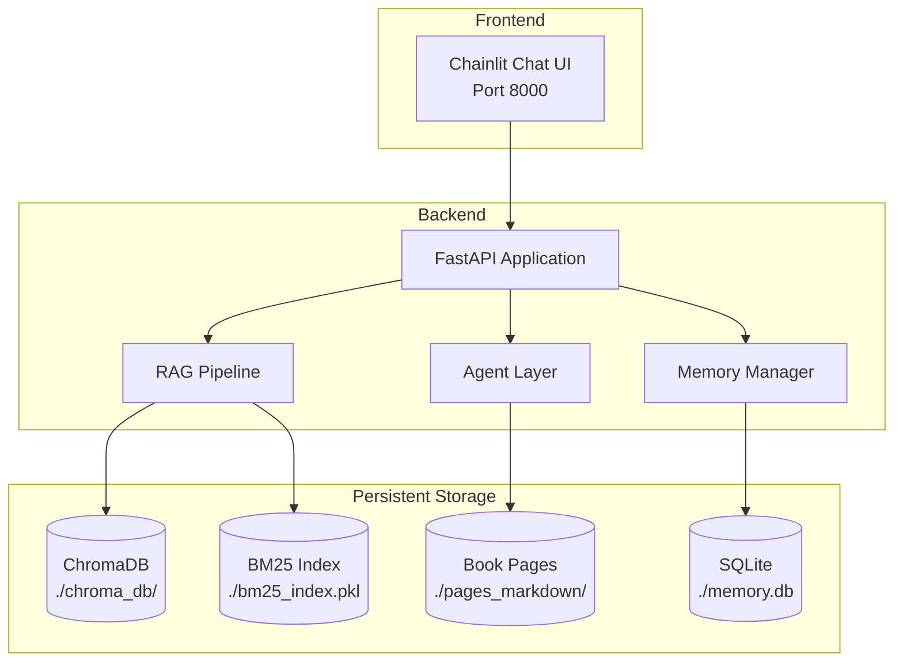

# Deployment

> **Back to**: [[01-system-overview/System Diagram]]

## Architecture



---

## 1. UI Choice: Chainlit

### Why Chainlit

| Feature | Chainlit | Streamlit | Gradio | Custom React |
|---------|----------|-----------|--------|-------------|
| Chat-native | **Yes** | Adapted | Adapted | Manual |
| Streaming | **Built-in** | Limited | Limited | Manual |
| Tool use display | **Built-in** | Manual | Manual | Manual |
| Source citations | **Built-in** | Manual | Manual | Manual |
| Session management | **Built-in** | Manual | Manual | Manual |
| Setup time | **Minutes** | Hours | Hours | Days |
| Customization | Good | Good | Limited | Unlimited |

Chainlit is purpose-built for conversational AI with RAG. It handles streaming, citations, feedback buttons, and tool use visualization out of the box.

### Basic Chainlit App

```python
# app.py
import chainlit as cl
from pipeline import RAGPipeline, SessionManager

pipeline = RAGPipeline()

@cl.on_chat_start
async def start():
    """Initialize a new chat session."""
    session_mgr = SessionManager()
    session_id = session_mgr.start_session()
    cl.user_session.set("session_mgr", session_mgr)
    cl.user_session.set("session_id", session_id)
    cl.user_session.set("history", [])

    warmup = session_mgr.get_warmup_context()
    if warmup:
        await cl.Message(
            content="Welcome back! Here's what we covered last time:\n\n" + warmup
        ).send()
    else:
        await cl.Message(
            content="Welcome! I'm an expert on *The New Toughness Training for Sports* "
                    "by James Loehr. Ask me anything about the book."
        ).send()

@cl.on_message
async def main(message: cl.Message):
    """Handle incoming messages."""
    session_mgr = cl.user_session.get("session_mgr")
    history = cl.user_session.get("history")

    # Create streaming message
    msg = cl.Message(content="")
    await msg.send()

    # Run pipeline with streaming
    full_response = ""
    async for token in pipeline.query_streaming(
        query=message.content,
        conversation_history=history,
        session_mgr=session_mgr
    ):
        full_response += token
        await msg.stream_token(token)

    await msg.update()

    # Add source elements
    sources = pipeline.last_sources
    for source in sources:
        await cl.Text(
            name=f"Page {source['page']}",
            content=source['text'],
            display="side"
        ).send()

    # Update history
    history.append({"role": "user", "content": message.content})
    history.append({"role": "assistant", "content": full_response})
    cl.user_session.set("history", history)

    # Extract facts in background
    session_mgr.extract_facts(full_response, pipeline.last_contexts)

@cl.on_chat_end
async def end():
    """Clean up session."""
    session_mgr = cl.user_session.get("session_mgr")
    if session_mgr:
        session_mgr.end_session()
```

### Chainlit Features to Use

| Feature | How |
|---------|-----|
| Streaming | `msg.stream_token(token)` |
| Source panel | `cl.Text(display="side")` |
| Feedback buttons | Built-in (thumbs up/down on each message) |
| File upload | `cl.AskFileMessage` (for adding more books later) |
| Step visualization | `cl.Step` (shows tool calls in progress) |
| User auth | `cl.password_auth_callback` |

---

## 2. Project Structure

```
toughness/
├── app.py                    # Chainlit entry point
├── pipeline/
│   ├── __init__.py
│   ├── rag.py               # Full RAG pipeline
│   ├── retrieval.py          # Search, rerank, assemble
│   ├── generation.py         # LLM generation with routing
│   ├── memory.py             # Session & fact management
│   └── agents.py             # Tool definitions & execution
├── indexing/
│   ├── __init__.py
│   ├── chunk.py              # Semantic chunking
│   ├── enrich.py             # Contextual enrichment
│   ├── embed.py              # Embedding generation
│   ├── raptor.py             # RAPTOR tree builder
│   └── run_indexing.py       # One-time indexing script
├── evaluation/
│   ├── test_data.json        # Gold standard Q&A pairs
│   ├── run_ragas.py          # RAGAS evaluation
│   ├── run_deepeval.py       # DeepEval evaluation
│   └── test_components.py    # Unit tests
├── data/
│   ├── pages/                # 232 JPG page images
│   ├── pages_markdown/       # OCR'd markdown per page
│   ├── chroma_db/            # ChromaDB vector store
│   ├── bm25_index.pkl        # BM25 index
│   ├── memory.db             # SQLite memory database
│   └── book_summary.txt      # Cached book summary
├── .env                      # API keys
├── requirements.txt
├── Dockerfile
├── docker-compose.yml
└── chainlit.md               # Chainlit welcome page
```

---

## 3. Environment & Configuration

### .env File

```env
ANTHROPIC_API_KEY=sk-ant-...
GOOGLE_API_KEY=AIza...
VOYAGE_API_KEY=pa-...
COHERE_API_KEY=...

# Model configuration
DEFAULT_MODEL=gemini-2.5-flash
COMPLEX_MODEL=claude-sonnet-4-5-20250929
OCR_MODEL=gemini-2.0-flash

# Pipeline configuration
CHUNK_SIZE=512
CHUNK_OVERLAP=100
RERANK_TOP_K=5
MAX_CONTEXT_TOKENS=4000

# Cost controls
DAILY_BUDGET=2.00
```

### requirements.txt

```
# Core
anthropic>=0.40.0
google-genai>=1.0.0
voyageai>=0.3.0
cohere>=5.0.0

# Vector store
chromadb>=0.5.0

# Search
rank-bm25>=0.2.2

# ML
scikit-learn>=1.4.0
numpy>=1.26.0

# Text processing
ftfy>=6.1.0
pyspellchecker>=0.8.0
rapidfuzz>=3.6.0

# UI
chainlit>=1.1.0

# Evaluation
ragas>=0.1.0
deepeval>=0.21.0

# Utilities
tenacity>=8.2.0
python-dotenv>=1.0.0
Pillow>=10.0.0
```

---

## 4. Docker Deployment

### Dockerfile

```dockerfile
FROM python:3.12-slim

WORKDIR /app

# Install dependencies
COPY requirements.txt .
RUN pip install --no-cache-dir -r requirements.txt

# Copy application
COPY . .

# Pre-built indexes should be in data/
VOLUME /app/data

EXPOSE 8000

CMD ["chainlit", "run", "app.py", "--host", "0.0.0.0", "--port", "8000"]
```

### docker-compose.yml

```yaml
version: '3.8'

services:
  app:
    build: .
    ports:
      - "8000:8000"
    volumes:
      - ./data:/app/data    # Persist indexes and memory
      - ./.env:/app/.env     # API keys
    environment:
      - CHAINLIT_AUTH_SECRET=your-secret-here
    restart: unless-stopped
```

### Deployment Commands

```bash
# First time: build and index
docker compose build
python indexing/run_indexing.py  # Run locally (needs API keys)

# Run
docker compose up -d

# View logs
docker compose logs -f app

# Stop
docker compose down
```

---

## 5. Local Development (No Docker)

```bash
# Create virtual environment
python -m venv .venv
source .venv/bin/activate  # Linux/Mac
# .venv\Scripts\activate   # Windows

# Install dependencies
pip install -r requirements.txt

# Set up environment
cp .env.example .env
# Edit .env with your API keys

# Run indexing (one-time)
python indexing/run_indexing.py

# Run the app
chainlit run app.py -w  # -w for watch mode (auto-reload)
```

---

## 6. Performance Optimization

### Startup Optimization

```python
# Pre-load heavy resources at startup
import chromadb

# Load once, reuse across requests
chroma_client = chromadb.PersistentClient(path="./data/chroma_db")
collection = chroma_client.get_collection("toughness_training")
bm25_index = BM25Index.load("./data/bm25_index.pkl")
book_summary = open("./data/book_summary.txt").read()
```

### Caching Strategy

| What | Cache Duration | Method |
|------|---------------|--------|
| System prompt | 5 minutes | Anthropic prompt caching |
| Book summary | Permanent | File on disk |
| ChromaDB collection | Session | In-memory after first load |
| BM25 index | Session | In-memory after first load |
| Recent embeddings | 1 hour | LRU cache |

```python
from functools import lru_cache

@lru_cache(maxsize=100)
def cached_embed_query(query: str) -> tuple:
    """Cache recent query embeddings (tuple for hashability)."""
    return tuple(embed_query(query))
```

### Parallel Execution

```python
import asyncio

async def parallel_search(queries: list[str]) -> tuple:
    """Run vector and BM25 search in parallel."""
    vector_task = asyncio.create_task(async_vector_search(queries))
    bm25_task = asyncio.create_task(async_bm25_search(queries))

    vector_results, bm25_results = await asyncio.gather(vector_task, bm25_task)
    return vector_results, bm25_results
```

---

## 7. Scaling Considerations

For a single-book, single-user system, scaling is not a primary concern. However, if expanding:

| Scenario | Solution |
|----------|----------|
| Multiple books | Separate ChromaDB collections per book |
| Multiple users | Add user_id to all DB tables, Chainlit auth |
| High query volume | Add Redis caching layer, async workers |
| Large books (1000+ pages) | Qdrant instead of ChromaDB, batched indexing |

---

## 8. Security Checklist

- [ ] API keys in `.env`, never in code or git
- [ ] `.env` in `.gitignore`
- [ ] Chainlit auth enabled for production
- [ ] Input sanitization on user messages
- [ ] Rate limiting on API endpoints
- [ ] Docker running as non-root user
- [ ] No sensitive data in logs

---

## 9. Full Cost Summary

### One-Time Setup Costs

| Component | Cost |
|-----------|------|
| OCR (Gemini 2.0 Flash, 232 pages) | $0.07 |
| Contextual Enrichment (with caching) | $0.35 |
| Embeddings (Voyage-4-large) | $0.02 |
| RAPTOR summaries | $0.15 |
| Book summary generation | $0.03 |
| **Total setup** | **~$0.62** |

### Monthly Operating Costs (50 queries/day)

| Component | Monthly Cost |
|-----------|-------------|
| LLM queries (70% Flash, 30% Sonnet) | $10.05 |
| Cohere Reranking | $3.00 |
| Query embeddings | $0.10 |
| Query expansion (Gemini Flash) | $0.50 |
| ChromaDB | Free |
| SQLite | Free |
| Infrastructure (local/Docker) | Free |
| **Total monthly** | **~$13.65** |

### Cost Per Query Breakdown

| Component | Cost/Query |
|-----------|-----------|
| Query classification | $0.0001 |
| Query expansion | $0.0003 |
| Query embedding | $0.00001 |
| Vector search | Free |
| BM25 search | Free |
| Cohere Rerank | $0.002 |
| LLM (Flash) | $0.001 |
| LLM (Sonnet) | $0.020 |
| **Average query** | **~$0.009** |

---

## 10. Dependencies

```
pip install chainlit python-dotenv
```

For Docker:
```
docker >= 24.0
docker-compose >= 2.0
```

---

#deployment #chainlit #docker #performance #security #cost
